大约9月6日下午6点，Icenowy给我发了一个贴子的链接，嗯，来自66RPG的帖子。发帖人是柳柳，66RPG的站长。

有关注的小伙伴们应该知道发生了什么事。

<!-- more -->

<audio src="wu-xin.mp3" controls="controls" autoplay="autoplay"></audio>

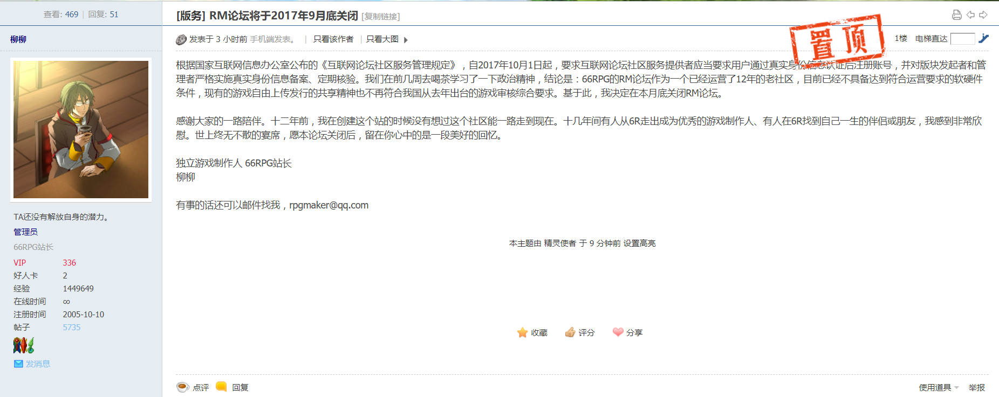

## 故事起源，一个念头

6年前，2011，我还是一个刚刚踏入中学的学生，平时就喜欢打打小游戏，或者打打怀旧经典游戏。一次无意中的搜索，让我接触到一个游戏开发软件——`RPG Maker XP`。

5年前，2012，初二，不知道是什么原因，导致我产生了一个念头。我要为表弟制作一个游戏，作为他的生日礼物。回想自己一年前的搜索，自然选择了`RPG Maker XP`。这是开端。

也许是庆幸自己当初还会搜索一下，也因此搜到了`66RPG`这个平台，然后开始了自己长期的潜水生活。

我承认，我自己是三分钟热度，最终没有坚持下来，没有给表弟制作出一个像样的游戏。但是，暑假这两个月，彻底改变了我的人生。我从一个不知编程为何物的小白，进化成了一个对`RGSS`略懂一二的初级菜鸡。如果没有这次经历，我接下来的四年大概在学习与小说中度过，然后考个像样的大学，跟父亲和姐姐一样就读会计学，考证学习，最终毕业找工作。但是这一切没有发生，`RPG Maker XP`或者说`66RPG`修改了我原本预设的路线。

后来啊，开学了，初三了，我发现我已经喜欢上研究`RGSS`脚本的感觉了。甚至，可以用疯狂二字来形容自己，我都不知道为什么一直三分钟热度的自己突然如此的执着于学习这些看起来是不学无术的东西。为了能够在上课日学习，我专门把`RPG Maker XP`的`F1文档`一页页复制粘贴到TXT文件中，然后把`RGSS`的大约80个标签对应的脚本代码分别粘贴到对应名字的TXT文件中，为了保持标签的顺序还一个个给这些TXT标号。然后将这些TXT都导入到我的`诺基亚E71`中，每天上课回来，不用开电脑都能看脚本。这个决定坚持了9个月，在这9个月中，我几乎没有看小说，大概是从我看小说以来弃坑坚持最久的。

2012年10月20日，我注册了`66RPG`账号。我从一个只在6R主站找代码和在论坛潜水的初级菜鸡，升级成了开始在6R论坛冒泡的中级菜鸡。我开始在`水世界`找存在感，开始在`RMXP提问区`回答问题，开始在`RMVX提问区`参加周末抓虫活动。在提问区回答问题，得到别人的肯定之后，感到很自豪满足。后来，提问区来了一个常客，叫美丽晨露，我回答了她很多问题(也不多)，同时也认识了这个小朋友。初三这一年，最自豪的大概是在6R这个小小论坛里面，有个叫晨露的游戏开发爱好者叫我`RMXP高手`，当时的自己大概也很自大吧。现在回想起来，自己是多么天真，宛若井底蛙。不过这也让我很欣喜，毕竟我的努力得到了肯定，我这一年的执着没有白费。后来，晨露多次在游戏发布的时候同时艾特我，但是我只玩过其中一个游戏，很是惭愧。

2013年春节，接了人生第一单悬赏，完成了笵妮拉·亚修的悬赏。当初的我，拿了30VIP之后沾沾自喜。现在回想起来，总感觉对不起ta，自己低下的水平，如果是让别人来接这个悬赏，或许会做的更好吧。

再后来，3月了，还有3个月就要中考了，我决定拆掉手机的电池，在接下来的3个月中不再接触手机。我的确做到了，3个月没接触我的`诺基亚E71`，虽然平时周末看看6R有啥新闻。接下来的3个月，经历了我人生中很多事情：买了人生第一本编程书籍、提前班考试分数差了3.67分、中考……

中考之后，我重返了6R，但是再也找不到那种感觉，那种让我沉迷代码的感觉。我又开始看小说，开始各种颓。一开始自己还想写个简单的RGSS脚本，还很正经的上论坛发帖询问，现在想想真是中二。后来，我开始学习C++，开始搞各种乱七八糟的东西。慢慢地，在论坛混的时间越来越少。

9月开学，高中了。入学的成绩在班里面排26，感慨大家都很厉害的同时，赶紧抓紧时间学习。再后来，进入了竞赛班，进入了学校的IT社团，接触到更多的东西，6R在我日常生活中渐渐淡化。

2013年10~11月，弃坑了。我弃坑RM了，开始研究各种乱七八糟的东西，开始用WindowsAPI、C++各种瞎搞。虽然有时候回去6R看看，但是真的次数很少。

14年，偶然一次机会得知，6R分家了。`66rpg.com`这个域名被分给橙光了，而老论坛域名改成`rm.66rpg.com`。大概是这个时候开始，6R就人气不再。当时回去看看，6R已经不如13年热闹了。

再后来，14年15年16年，基本很少理会6R。

直到17年9月6日，Icenowy告知我，6R-RM站要关了。

很伤感，但是我能说什么呢？天下没有不散的筵席，一个亏本的论坛迟早要关闭，六趣能坚持维护6R至今已经很不错了。

6R、RM给我带来的影响很大，我写下这篇文章，也是希望自己以后能记住，有一个叫66RPG的网站改变了我的一生。其实，或许，我心目中的6R，已经在分家之后就不复存在了。

17年10月1日，大概，`rm.66rpg.com`无法访问了吧。

## 大概是最后一贴了吧

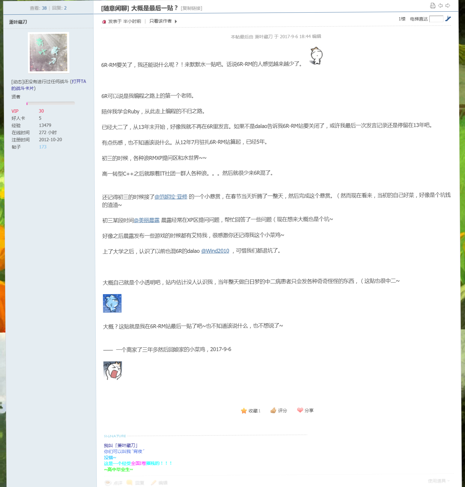

**这是我的荣幸，也是我的幸运，谢谢~**

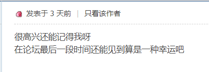

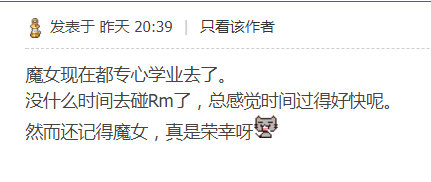

## 截图

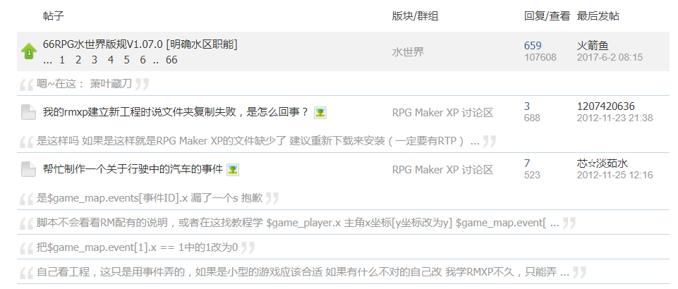

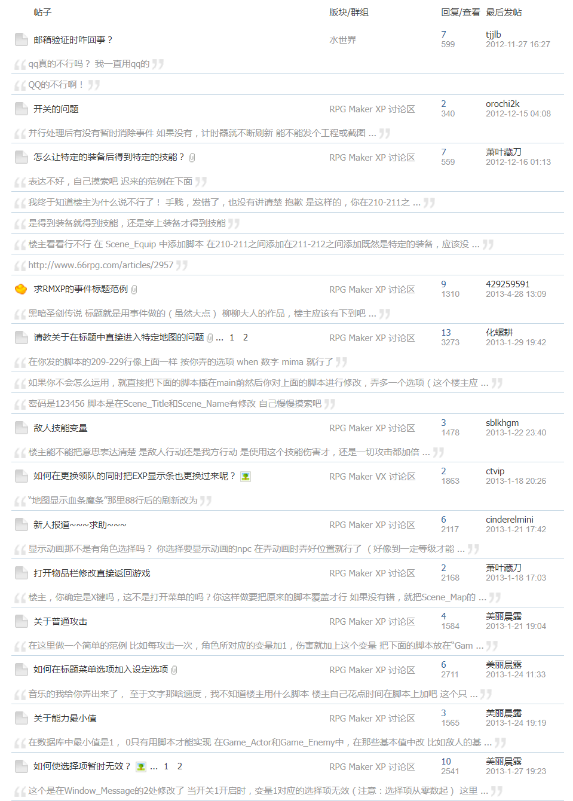

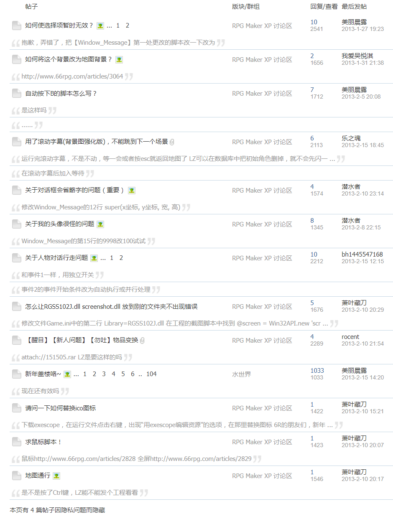

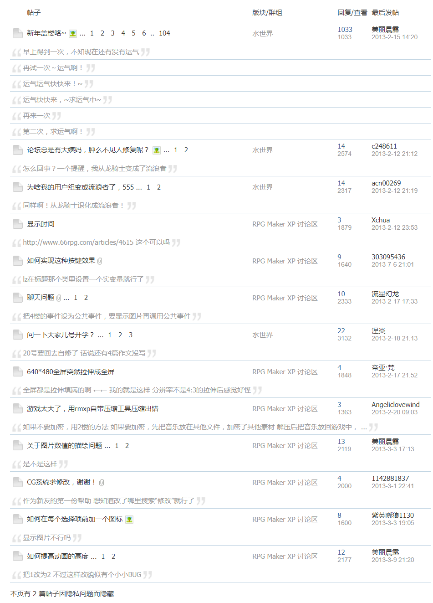

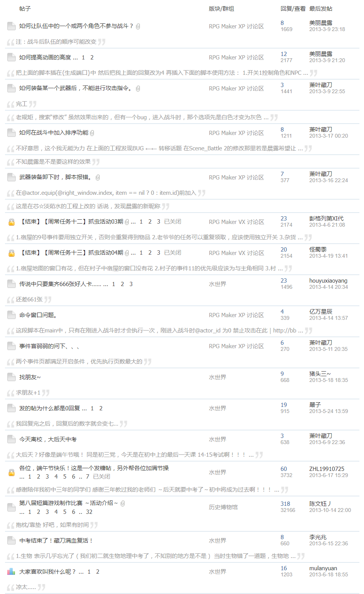

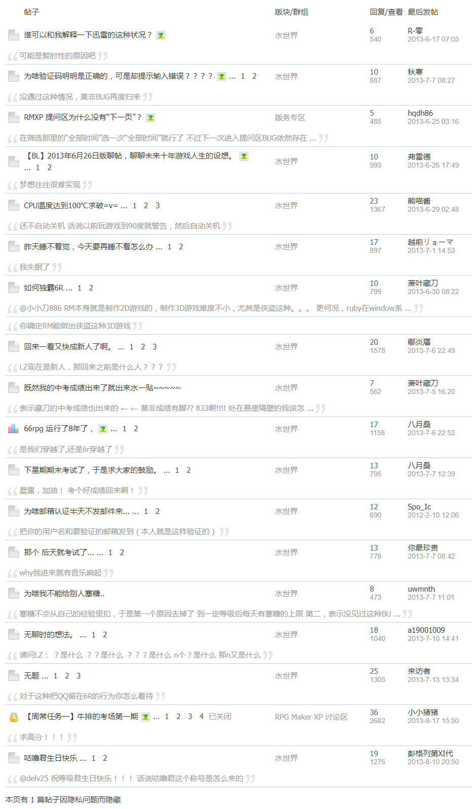

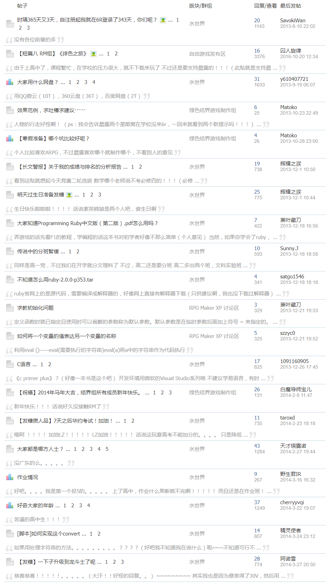

## 9月30日

传说中的6R-RM站的最后一天，其实早在27日六趣已经和6R管理组织交接数据库和论坛所有权，现在进入`rm.66rpg.com`已经提示访问`rpg.blue`了。很感谢6R各位大大能站出来，继续维护这个小站，也很抱歉自己实力单薄无法做出帮助。本来想是在6R主站`论坛再见`活动中写一些自己的感谢，结果因为没有实名无法发言。最后还是把写的东西都删了，欸~

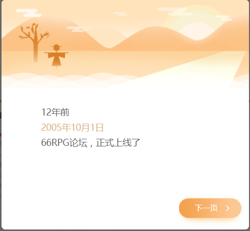
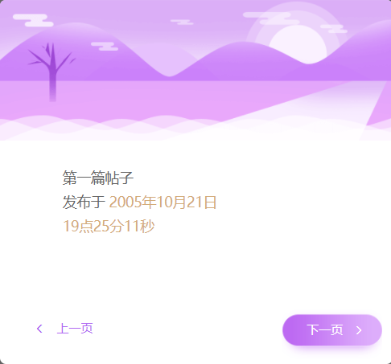
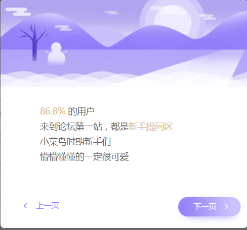
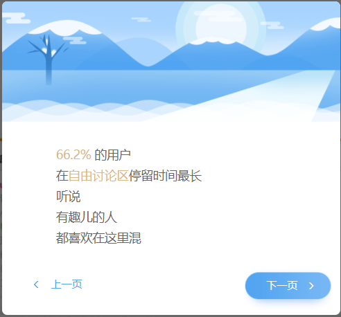

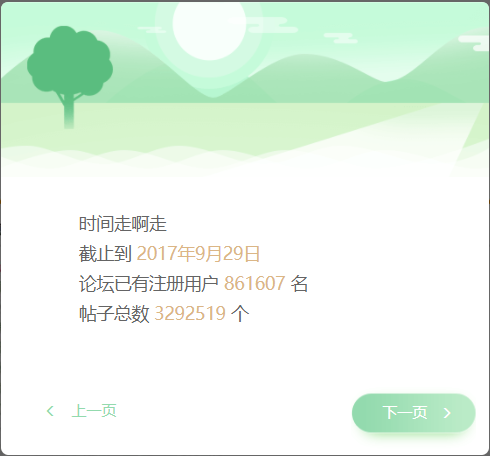
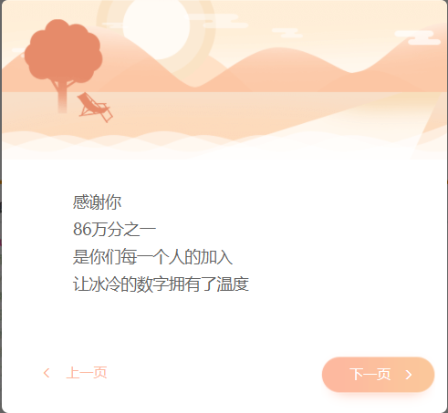
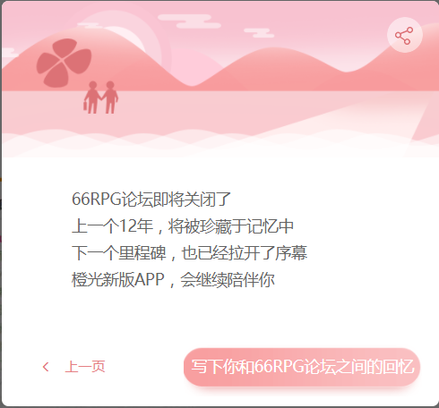

## Project 1

`Project 1`，新建属于你的世界。

我们开始于Project 1，最终也结束于Project 1。

这个名字，我很喜欢~

## 写在最后

梦想世界，在你手中。

论坛，再见。

