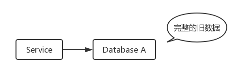
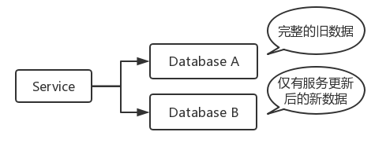
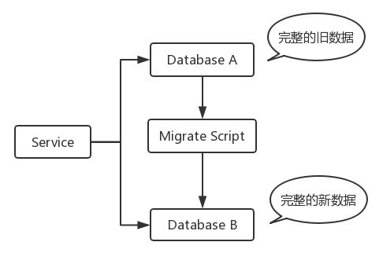
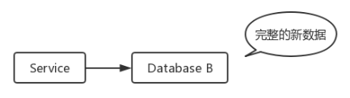
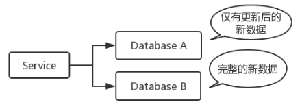
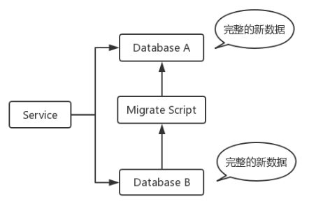
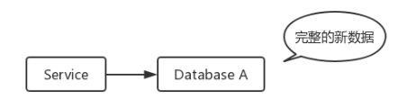

最近遇到了一个这样的场景，需要对一些持久化或者非持久化的数据进行修改，也就是所谓简单的数据迁移。本文将简单分析一下该场景，以及介绍如何使用数据双写来实现迁移。

<!-- more -->

## 数据迁移的场景

可能你在开发某个项目的时候，会遇到这样的情况：项目上线了，然后为了优化或者别的理由，决定对持久化或者非持久化的数据进行结构上的修改，比如存储在Redis、MySQL或者别的数据库上的数据。

也可能是我们之前的逻辑写错了，导致存储一些错误的数据，我们需要对现有数据进行校正。

不管是上述哪种场景，从编码的角度上看，无论是修改结构的逻辑、修复写错的逻辑都是一件非常简单的事情。对于现有数据的修复校正，也是可以写一个脚本即可完成的任务。

当然，我们今天需要讨论的不仅仅这么简单。

## 平滑迁移与不平滑迁移

我们上文讨论到项目已经上线并且拥有了部分数据，那就意味着我们的服务正在运行，并且我们不希望在迁移的过程中服务中断。这就是所谓的平滑迁移，即对于用户而言对这次迁移是无感知的，我们的服务在迁移过程中不会出现任何时刻的中断。

而不平滑迁移就很容易理解了，就是服务停机维护，然后进行数据迁移。

不平滑迁移很简单，我们只需要通知用户在特定时间停机维护，然后在该时间段将服务下线，再执行迁移脚本即可。如果有需要的话，还可以在下线期间更新服务的源码，修改部分逻辑。

但是在大部分情况下，我们都不希望通过停机维护的方式来进行数据迁移，因为这样会影响用户的体验。并且不平滑迁移还有一个缺点是时间限制，当我们发布了停机维护公告后，就意味着我们需要在这段时间内完成迁移，如果出现问题导致迁移时间不够，那我们等待下一次机会重新进行停机维护，否则这对产品会有一定程度的影响。

在很多业务场景下，我们更希望是用户无感知地平滑迁移数据。而平滑迁移的难点就在于，如何保证迁移之后的数据一致性。因为在执行迁移脚本的过程中，服务可能会接收到用户的请求，而我们需要保证这些请求涉及到的数据更改也能被成功写到数据库中。

对于平滑迁移，可以利用日志法和双写法来实现。日志法就是记录迁移阶段的数据修改日志，然后根据日志多次反复迁移，使得新数据库与旧数据库之间数据追平。但是这种方法比较复杂，而且对于一些数据库可能本身就没有提供日志，需要自己去记录日志，迁移成本比较高。双写法就是利用上线数据双写的逻辑，来实现服务同时写入新旧数据库，实现数据迁移。

接下来，我们介绍一下数据双写的具体流程。

## 数据双写

在进行数据迁移之前，我们的逻辑如下。

此时，我们需要对服务现有的逻辑进行修改，上线一个双写逻辑。所谓的双写，也就是在对原有数据库增删改的逻辑的地方，也加上对新的数据库的增删改。只不过，对原有数据库我们还是保持原来的逻辑，而新的数据库使用新的结构和新的逻辑。

在上线双写逻辑之后，我们的服务现在是这样的。

在我们的服务上线之后，用户的请求都会写到两个数据库上，这意味着数据库B中仅存在这段时间由新逻辑产生的新数据，而数据库A还是完整的旧数据。

如果我们此时编写一个数据迁移的脚本，将A中的数据迁移到B中，那么在数据迁移阶段，即使有新的请求到来，数据也会被写入到新的数据库中。这样，A、B中的数据都是完整的。

然后我们只需要下线双写逻辑，仅保留新的逻辑，即可实现数据的迁移。

从上述的流程中，可以发现每一个阶段都存在至少一份完整的数据。同时，双写的逻辑可以使得在迁移过程中的用户请求依然能正确地写入到新的数据库中，这样就能保证数据的一致性。

## 数据迁回

在Redis缓存数据库上进行数据迁移的时候，可能会出现这种情况：在Redis里面以键`user_xxxxxx`的形式存储了用户的信息，然后需要改结构只能将键改成`new_user_xxxxxx`来存储。如果后面再经过几次迭代之后又发生了几次迁移，说不定键会被改得不忍直视。这个时候，可能一开始就会想把键迁回到`user_xxxxxx`中。

其实迁回就跟上一节的数据双写类似，同样是一个双写的策略。

一开始我们的逻辑如下，仅写入数据库B。

然后我们上线双写逻辑，对A也写入新逻辑生成的数据。当然，在此之前，可能要先对A进行删除等处理。(视业务场景决定，可能部分场景不需要该操作)

接下来就是进行数据迁移。

最终只需要把B的相关逻辑给下掉即可。

数据迁回的部分从原理上与数据双写一样，也是非常简单的操作，即可实现数据的迁移。

## 结语

本文简单介绍了一下数据双写的一个流程和用途，在业务开发中，由于开发人员的疏忽或者后期业务需求的改动，导致这种需要进行数据迁移的情况还是蛮常见。

不过，需要注意的是，**记得每次执行完迁移脚本一定要对比一下新旧数据是否为预期数据。**

