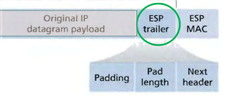
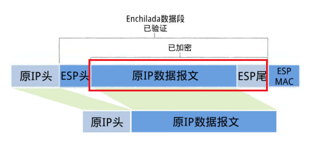
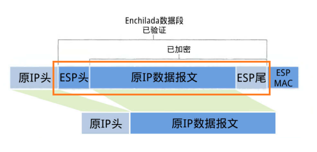

本文简单概述一下什么是IPSec以及传输模式下ESP报文的装包和拆包过程。由于作业不要求讲解隧道模式下的ESP报文的装包和拆包，这里就不提及了。

<!-- more -->

## 什么是IPSec？

**互联网安全协议(Internet Protocol Security, IPSec)**是一个对IP分组进行加密后再传输的网络传输协议。

IPSec主要包含了认证头(AH)、封装安全载荷(ESP)、安全关联(SA)三种协议。其中，AH和ESP可共同用于网络传输，也可单独使用。

IPSec需要实现以下的内容，以确保数据传输能正常进行：

* 数据的保密性。
* 数据的完整性。
* 数据的来源认证。
* 防止数据回放攻击。

IPSec的报文传输又分为**隧道模式(Tunnel Mode)**和**传输模式(Transport Mode)**两类。

隧道模式下IPSec将整个原始IP报文作为数据内容，即包含了原始报文的IP报文头和原始报文的有效载荷，隧道模式生成的IP报文拥有一个新的IP头。在整个传输过程中，原始报文的结构不会改动。

传输模式下IPSec只将原始IP报文的有效载荷作为数据内容，而不包含原始报文的IP报文头，传输模式将根据在原有的IP头的基础上修改相应的数据得到。在传输的前后，原始报文的结构将会被破坏。

## 传输模式下ESP报文的装包拆包

### 传输模式下ESP报文的装包

传输模式下ESP报文的装包分为以下6个部分：

**(1) 将原IP报文拆分成IP头和IP数据报文两部分。**

根据传输模式处理原始IP报文的规定，首先将原始IP报文拆分为IP头和有效载荷数据段。其中，前者将作为IPSec报文的报文头，并且协议会被修改为50，标识为这是一个ESP报文。后者将作为ESP报文数据生成的数据来源。

**(2) 在原IP数据报文末尾添加ESP trailer(尾部/挂载)信息。**

其次，在原IP原始报文的末尾添加ESP尾部信息。ESP尾部信息包括三部分：块加密填充区、填充长度、被封装的原始报文的协议类型(也称为Next Header)。

**(3) 对原IP数据报文和ESP尾部信息加密。**

然后根据SA所给定的加密算法和密钥，将IP的有效载荷和ESP尾部信息作为一个整体，进行加密。

**(4) 在加密数据头部加上ESP头。**

为第3步得到的加密数据添加ESP头，ESP头有SPI和Seq#两部分组成。加密数据和ESP头合称"Enchilada"，构成认证部分。

**(5) 计算Enchilada的MAC值。**

根据ESP头和加密数据共同组成的数据，计算其MAC值，并将MAC值添加到加密数据尾部。MAC值用于完整性度量，其度量算法包括所需要的认证密钥由SA给定。

**(6) 将原IP头添加到上述数据的头部，组成新的IP报文。**

在该步骤中，原IP头的协议将被修改为50，标明封装的是一个ESP报文。

### 传输模式下ESP报文的拆包

传输模式下ESP报文的拆包分为以下6个步骤：

**(1) 获取SA信息。**

接收方收到IP报文后，发现该IP报文的协议类型为50，即表示这是一个封装的ESP报文。然后接收方会主动查看ESP头，通过ESP头的SPI信息来决定该报文所对应的SA，从而得到该报文是基于传输模式生成的还是基于隧道模式生成的。同时，也通过SA得到了加密算法和解密密钥、度量算法和认证密钥。

**(2) 拆分IP报文头和IP报文数据。**

确定了IP报文是基于传输模式生成的之后，接收方将拆分该IP报文成报文头和有效载荷两部分。其中，前者作为恢复之后的报文的报文头，后者作为之后步骤验证和解密的数据来源。

**(3) 验证数据完整性。**

取出IP报文数据尾部的固定长度的数据，将其视为Enchilada的MAC数值段，而剩余部分视为Enchilada。通过SA所指定的度量算法和认证密钥，使用MAC值对Enchilada进行完整性验证。

**(4) 防止数据回放攻击。**

检查ESP头中的Seq#数据里面的序列号，保证数据是新的，而不是由第三方恶意重复发送的。

**(5) 解密数据。**

取出Enchilada中关于ESP头的数据，将剩余部分视为被加密过的数据。根据SA所指定的加密算法和密钥，解密被加密过的数据，得到原IP报文数据段和ESP尾部信息。

**(6) 删除填充数据。**

将ESP尾部信息中的Next Header和Padding Length提取出来，根据Next Header修改IP头的协议，然后根据Padding Length删去填充区的数据。此时，得到了协议被修改回原始IP协议的IP头，以及IP报文数据段。

**(7) 合并IP头和IP报文数据，形成原始IP报文。**

将IP头和IP报文数据合并起来，恢复原始IP报文的结构。

