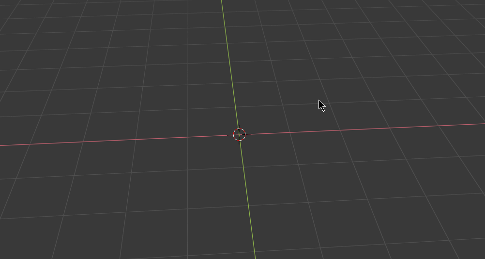
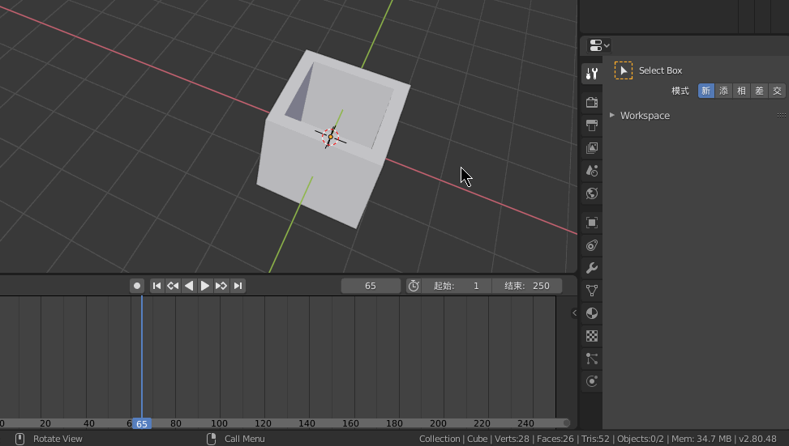
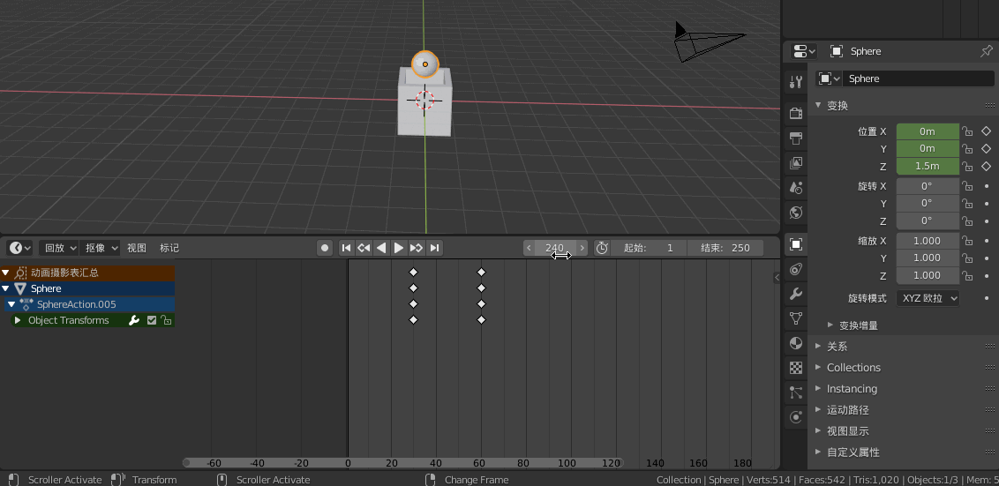
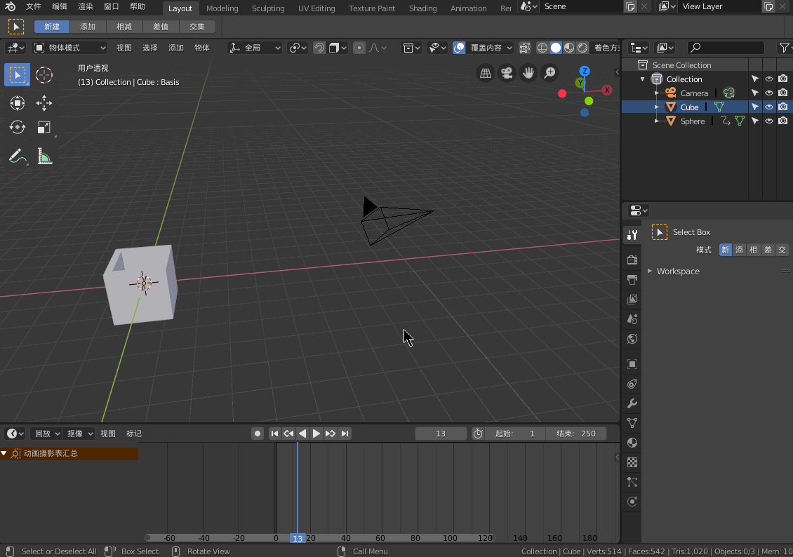

对于游戏制作过程中，如何建立更美观、更精细的模型一直是程序员的一大难题。3D建模的软件有很多，Blender是一款免费且开源的著名3D建模软件。本文将采用Blender来制作一个简单的盒子动画。

<!-- more -->

## 实现目标

需要实现的动画要求如下：

* 场景中存在一个空盒子与一个球，初始场景球在空盒子内部。
* 盒子的底部将缓慢升起，球将被弹出盒子外。
* 球掉落在地上将发生形变，并且从地面反弹。
* 最终球平稳落地。

最终的实现效果大致如下：

## 使用Shape Key控制盒子的形变

首先，我们需要绘制一个空盒子。绘制一个立方体很简单，直接新建立方体就可以了。而将立方体变成中空的，需要我们对立方体的各个面进行操作。

* 通过`Shift + A`(Add)打开添加菜单，新建一个立方体。
* 通过`Tab`进入编辑模式，切换至面选择模式。
* 选择顶部的面，使用`I`(Inset)嵌入新的面，并选中这个新的面。
* 通过`Z`切换至网格边框模式，然后通过数字键`1`将视图切换至立方体的正面。
* 通过`E`(Extrude)对新的面进行挤压，将该面拉至立方体底部，以构成空盒子形状。

接下来我们需要使用Shape Key来实现盒子的形变，也就是将盒子的底部上升和下降的动画给实现出来。

Shape Key可以记录一个物体的新形态，而不改变物体原有的形态。实际上，它是将物体原有的形态记录为名为`Basic`的Shape Key，然后再修改新的Shape Key的形态，并绑定`Basic`形态。我们将新的形态假设为值1，而原始形态就是值0，那么值在0~1之间变化，即可实现形态之间的变化。

* 在属性菜单选中盒子，进入物体数据属性界面，添加两个形态键。
* 将Key1形态键的值设为1，并且修改Key1时的盒子形态。
* 将当前值设为0，往第30、90帧添加当前形态的关键帧。
* 将当前值设为1，往第60帧添加当前形态的关键帧。
* 播放动画，即可看到盒子底部上升和下降的动画。

## 实现球的移动和形变

接下来我们需要创建球，并且实现球的移动和形变。

* 通过`Shift + A`创建一个球体，然后通过吸附功能将其放置在盒子底部。
* 将当前位置添加至第30帧。
* 将球体移动到盒子顶部，将当前位置添加至第60帧。

当然，我们还需要实现球的抛物线移动，我们可以在第120帧添加球落地的状态，然后通过曲线编辑器来修改球的运动轨迹。

接下来自然是通过Shape Key来实现球的形变。这里不再用GIF展示，跟上一节类似，创建一个Basic形态键和一个Key1形态键，然后将Key1的形态改为被压缩的形态，通过关键帧实现球的形变。

由于存在曲线编辑器，那在形变过程中可以对位置进行微调，非常直观。

## 给盒子添加材质

材质可以使用Blender自带的解决方案，也可在网上下载。

首先我们给物体添加材质，然后使用材质相关的蓝图工具，为材质设定相关属性或者导入图像材质。

当然，最后我们再添加一个平面，然后也给球加一个材质，就可以完成一开始我们展示的效果了。

## 结语

本文仅仅是简单地学习一下Blender的使用，并没有涉及更加复杂的东西。像这类工具类的软件，如果不看一下教程真的难以入手。当然， 为了实现物体的形变，我们学习了如何使用Shape Key，也学习了如何使用曲线编辑器、材质等。

实际上，我们所要实现的目标是有很多方法实现的。比如球体的形变，除了用形态键，我们还可以直接对Scale和Location插入关键帧，甚至可以利用曲线编辑器来调节效果。本文所利用的方法仅仅是我在学习过程中的尝试，或许有更好的方法，当然这里就不再深究了。