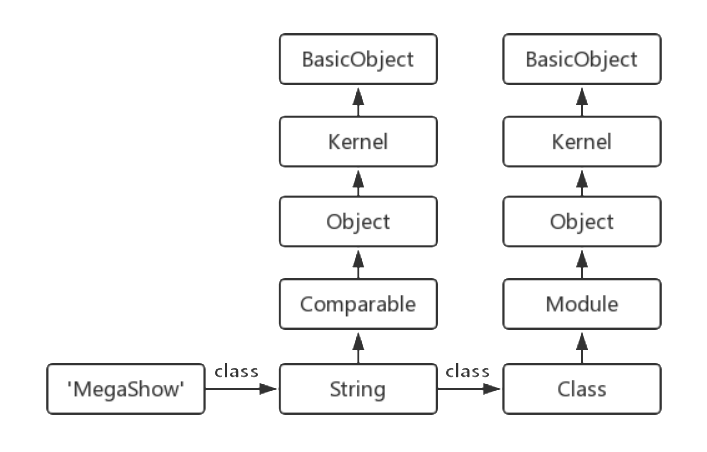

并不像大多数人一样，刚接触编程要么是C/C++、Java，要么是Python，我接触的第一门编程语言是Ruby，准确地说应该是Ruby的一种DSL实现——RGSS。因此，可以说我对Ruby有着偏执的感情，对Matz(Ruby之父)也是十分倾佩。

不过，虽然我是学习Ruby入门的，但是由于接触的始终是RGSS，一直没有深入了解Ruby，对Ruby元编程一大特性也从未涉及。本文将根据自己阅读《Ruby元编程(2nd)》一书，从Ruby元编程中认识Ruby这一门魔幻的编程语言。

<!-- more -->

## 什么是元编程？

元编程是编写能写代码的代码。

准确来说，元编程是编写能操作语言构件的代码。在Ruby的运行时中，我们可以向一个对象询问它的类、它的方法、它的超类甚至更多关于对象自身的信息。同样，我们也能修改一个对象、类的方法等信息。

比如，使用一个ORM库进行数据库操作时，如果存在一个`Book`类，该库将从数据库的`books`表中得到该表的所有字段，并针对各个字段生成getter、setter。这一过程，实际上就是运行时修改语言构件的过程。

当然，元编程并不仅仅是动态语言的专属特性。C的宏扩展，C++的模板元编程，Java、Golang的反射等，实际上都是元编程的例子。前两者被称为静态元编程，后者被称为动态元编程，也就是我们所说的运行时操作语言构件。

接下来让我们一步步走进Ruby的元编程世界。

## Ruby：一切皆为对象

Ruby是一门面向对象编程的语言，但是和普通的面向对象编程不一样，Ruby是一切皆为对象。

Java是一门典型的面向对象编程语言，Java的变量类型分为原始数据类型、引用数据类型。Integer变量是一个对象，而int是int。

在Ruby这类动态语言里面，基本任何东西都是对象。一个`String`类型的变量是一个对象，一个字面常量`123`也是一个对象，一个Lambda表达式是一个对象，一个对象的实例方法是一个对象，甚至，一个对象的类也是一个对象。

虽然Ruby宣称一切皆为对象，但实际上代码块`block`并不是对象。不过，代码块可以被转换成Proc或Lambda对象，因而大家就宣称Ruby一切皆对象了。

### 通过内省来获取对象信息

在TypeScript里面，可以通过`typeof`、`keyof`关键词来获得某个变量的类型、某个对象的键。而Ruby并不是通过关键词来获取对象的内部信息的，而是通过调用对象对应的类继承而来的方法来操作语言构件。

通过`Kernel#class`可以获取一个对象的类。

```ruby
String.new('MegaShow').class  # => String
```

前面有提及字面常量实际上也是对象，因此我们可以这样获取类。

```ruby
'MegaShow'.class  # => String
0.class           # => Integer
```

同样，类也是对象，因此我们也可以通过调用类这个对象的`Kernel#class`方法来获取类的类。

```ruby
String.class  # => Class
```

我们也可以通过类的`superclass`方法来获取它的父类。

```ruby
String.superclass  # => Object
```

也能获取类的方法、实例方法、受保护的方法、私有方法等。

```ruby
# 参数false表示忽视继承而来的方法，缺省为true
String.methods(false)            # 获取String类的方法
String.instance_methods          # 获取String类的实例方法
String.singleton_methods         # 获取String类的单例方法
String.private_methods           # 获取String类的私有方法
String.private_instance_methods  # 获取String类的私有实例方法
```

我们也可以通过一个对象来获取对象的方法、私有方法等。

```ruby
'a'.methods            # 获取String对象的方法
'a'.singleton_methods  # 获取String对象的单例方法
'a'.private_methods    # 获取String对象的私有方法
```

既然可以获取一个类的父类，那获取这个类的祖先链也不成问题。

```ruby
String.ancestors  # => [String, Comparable, Object, Kernel, BasicObject]
```

甚至，我们还能获取某个方法的源代码的位置。

```ruby
# /home/mega/a.rb
class T
  def method1; end
  def method2; end
end

t = T.new
t.method(:method1).source_location  # => ["/home/mega/a.rb", 3]
t.method(:method2).source_location  # => ["/home/mega/a.rb", 4]
```

### 类、模块、方法与对象

在诸如Java、C++等一些主流的面向对象编程语言中，通过类来实例化一个对象一般有如下的语法。

```java
Object obj = new Object();
```

而在Ruby里面，实例化的语法不太一样。

```ruby
obj = Object.new
```

这看起来只是语言不同而语法不同罢了，但是是否还记得，Ruby的类也是一个对象。是的，Ruby实例化的本质就是调用类的`new`方法，该方法的返回值便是该类的实例化对象。而在其他语言中，通常`new`是一个关键字。

因此，Ruby的对象，实际是通过调用特殊的对象(类)的`new`方法来实例化的。既然类本身也是一个对象，那类本身也是通过更加特殊的对象(类)的`new`方法来实例化的。通过内省可以得知所有类都是类`Class`的实例化对象，类`Class`自身也是它的实例化对象。至于Ruby内部如何实现的，那本菜鸡就不知道了。

```ruby
'MegaShow'.class  # => String
String.class      # => Class
Integer.class     # => Class
Object.class      # => Class
Class.class       # => Class
```

通过查询Ruby-Doc，我们得到了如下两条方法原型。不难得到，该方法的参数是生成的类的父类，缺省值为`Object`。这又很直观的解释了Ruby语法中，一个类如果不声明父类，那就默认继承于`Object`。

```ruby
# Class
new(super_class=Object) → a_class
new(super_class=Object) { |mod| ... } → a_class
```

现在我们来看看模块，模块也是对象，其类是`Module`。

```ruby
Kernel.class  # => Module
Module.class  # => Class
```

如果你了解过类与模块，就会知道`Module`是`Class`的父类。虽然是父子类关系，但是两者还是有不少区别。

```ruby
Class.superclass  # => Module
```

类与模块有如下两大区别：


* 类可以实例化，而模块不能实例化。
* 类存在继承关系，而模块不存在继承关系。

或许你会询问，为什么类可以实例化，而模块不能实例化？一般会告诉你这就是类和模块的区别，这就是语言特性，事实上Ruby这样解释也是没有问题的。不过，通过上面对Ruby类实例化的认识，我们知道Ruby的实例化实际上是调用`new`方法，而Ruby的模块，存在这个方法么？如果模块不存在这个方法，是否就能解释为什么模块不能实例化了。

```ruby
Class.method_defined?(:new)   # => true
Module.method_defined?(:new)  # => false
```

至于为什么类可以继承，而模块不能继承，那就更加容易解释了。我们观察一下类`Module`的实例化方法，与此前的类`Class`的实例化方法对比，即可理解此问题。

```ruby
# Module
new → mod
new {|mod| block } → mod
```

### 对象模型与方法调用

首先，先让我们来了解一种展示类与对象关系的对象模型图。(这种模型图在《Ruby元编程》、《代码的未来》中均出现过，不知道是否为Ruby约定俗成的模型图) 



最左下角是我们所要操作的对象，对象往右就是对象对应的类，类往上即为包括该类在内的祖先链。

```ruby
String.ancestors  # => [String, Comparable, Object, Kernel, BasicObject]
Class.ancestors   # => [Class, Module, Object, Kernel, BasicObject]
```

当然，这张图并不是完整的对象模型图，仅仅描述了一部分对象与类的关系。这种对象模型图通常用于描述方法调用的流程。

```ruby
'MegaShow' < 'Zhenly'  # => true
```

方法调用实际上就是方法查找的过程，Ruby首先在方法的接收者的类中寻找该方法(即一步向右)，然后依次从祖先链中寻找该方法(即逐步向上)，找到该方法之后即可终止方法查找。上述代码的方法即为`:<`，接收者为`'MegaShow'`这一对象。首先先从`String`类中寻找`:<`方法，然后从`Comparable`模块中寻找`:<`方法，此时，找到了该方法，通过接收者调用该方法。

对象模型图并不复杂，不过如果此前的章节你若是认真学习，就会发现一个细节性的问题。`String`的父类不是`Object`么，`Comparable`又是什么东西？为什么祖先链里面多出了一些非继承关系的对象？

```ruby
String.ancestors   # => [String, Comparable, Object, Kernel, BasicObject]
String.superclass  # => Object
```

实际上，一个类的祖先链，除了它的祖先类外，还包含了一些和祖先类相关的模块。模块不能被实例化，所以它是通过包含在类、模块中被使用的。这也就是所谓的**Mixin**，其他类可以访问Mixin类的方法而不必成为它的子类。不过Ruby里面，Mixin的对象只能是模块，而不能是类。

当一个模块被包含到类、模块中，那这个模块将被加入到该类、模块的祖先链中，方法调用将严格按照祖先链的顺序来查找方法。自然，模块的包含操作分为两种，一种的结果是模块插在被插入类、模块的前面，另一种的结果是模块插在被插入了类、模块的后面。

```ruby
module M end

class C
  include M
end

C.ancestors  # => [C, M, Object, Kernel, BasicObject]
```

```ruby
module M end

class C
  prepend M
end

C.ancestors  # => [M, C, Object, Kernel, BasicObject]
```

当然，这两种方法都是允许Mixin模块的方法视作别的类、模块的实例方法调用，Ruby还提供了一种将模块Mixin混入到别的类自身中，也就是作为类方法调用。

```ruby
module M
  def hello
    p 'hello, world.'
  end
end

class C
  extend M
end

C.hello      # => "hello, world."
C.new.hello  # => NoMethodError (undefined method `hello' for #<C:0x00007fffe8b10180>)
```

类方法？类的实例方法？感到脑子一片混乱？下面我们将从类入手，深入到Ruby的元编程世界中。

## 从定义类到打开类

### 类定义的本质

在Ruby中定义类使用了class和def关键字。

```ruby
class C
  def my_method
    p 'hello'  # => "hello"
  end
end
```

但是，在Ruby里面甚至可以往类语句块中添加语句，定义类的时候直接执行。

```ruby
class C
  p 'hello'  # => "hello"
end
```

可能一开始接触这种语法感觉特别神奇，因为在别的语言中，执行语句通常只存在于变量初始化或方法中。实际上Ruby的类定义，本质上就是一个执行语句，执行类的定义操作，并执行类内部的类语句块。同样的道理，def关键字实际上就是在执行方法的定义操作，只不过方法定义并不会执行方法语句块。

与普通的语句一样，类定义也是有返回值的，类定义会默认将类语句块的最后一句语句返回。

```ruby
result = class C
  self
end

result  # => C

result = class C
  def my_method
  end
end

result  # => :my_method
```

说到这里，你是否想起，类是类`Class`的实例化对象，因此类的定义又可以写成如下实现。

```ruby
C = Class.new do
  def my_method
    p 'hello'  # => "hello"
  end
end

c = C.new
c.my_method
```

甚至，我们可以依赖`Kernel#define_method`方法来生成类的实例方法。

```ruby
C = Class.new do
  define_method :my_method do
    p 'hello'  # => "hello"
  end
end

c = C.new
c.my_method
```

`Kernel`模块并没有提供定义类的方法，但是实际上我们可以自己实现一个功能相似的方法。(这里就不具体展开了)

### self与作用域门

Ruby的`self`用于表示当前对象，也相当于语言的上下文。Ruby的每一行代码都会在当前对象(上下文)中执行，通过`self`可以调用当前对象的方法或变量。仔细一想，`self`不就是相当于一个作用域么，如果当前对象发生了变化，那就相当于改变了作用域。

Ruby的作用域很特殊，不像其它语言支持多重作用域，即内部作用域可以在不覆盖的情况下访问外部作用域。Ruby的作用域是单一的，一旦当前对象发生变化，原作用域将不再可见。并且，Ruby在if、for、case等语句块中并不会改变作用域，因为当前对象并没有发生改变。

在Ruby中改变作用域的地方只有三处：

* 类定义
* 模块定义
* 方法

通过`Kernel#local_variables`可查看当前作用域下绑定的变量。

```ruby
v1 = 1

class C
  v2 = 2
  print "#{self}, #{local_variables}\n"  # => C, [:v2]

  def my_method
    v3 = 3
    for i in 0 .. 2
      v4 = i
    end
    print "#{self}, #{local_variables}\n"  # => #<C:0x00007fffbd903660>, [:v3, :i, :v4]
  end
end

C.new.my_method
print "#{self}, #{local_variables}\n"  # => main, [:v1]
```

可以观察到，Ruby的顶层代码在一个名为main的`Object`对象中执行。在类的定义中，当前对象为类本身。在类的实例方法中，当前对象为类的实例化对象。

### 类与方法、变量

变量一直是编程语言中至关重要的一大系统，Ruby将变量分为以下5类。

|          规则          |      类型      |                        说明                        |
| :--------------------: | :------------: | :------------------------------------------------: |
|       以`$`开头        |    全局变量    |               在程序的任何地方均可见               |
|       以`@`开头        | 对象的实例变量 |                在该对象的作用域可见                |
|       以`@@`开头       |     类变量     |             在该类(模块)或子类中 可见              |
|     以大写字母开头     |      常量      | 不得在方法中定义，内部作用域可访问外部作用域的常量 |
| 以小写字母、下划线开头 |    局部变量    |                  在当前作用域可见                  |

但是运行下列代码，得到的实例变量的值居然是nil。

```ruby
class C
  @a = 1
  def my_method
    p @a  # => nil
  end
end

C.new.my_method
```

表格中说明了，实例变量在该对象的作用域中可见，也就是说引用的实例变量实际上是当前对象的实例变量。在上述代码的两次`@a`的位置，实际上当前对象并不一样。前者的当前对象是类本身，而后者的当前对象是类的实例化对象。如果我们再加上一个实例变量，用`instance_variables`来获取当前的实例变量。

```ruby
class C
  @a = 1
  def my_method
    p instance_variables  # => []
    @b = 2
    p instance_variables  # => [:@b]
  end
end

p C.instance_variables  # => [:@a]
C.new.my_method
```

Ruby中的方法同样分为类的实例方法和类方法，前者是类的实例化对象的方法，后者是类自身的方法，也叫静态方法。

类方法的定义有很多种，其本质均是将方法绑定到类本身上。

```ruby
class A
  def self.my_static_method
    p 'hello, A'
  end
end

class B
  def B.my_static_method
    p 'hello, B'
  end
end

class C
  class << self
    def my_static_method
      p 'hello, C'
    end
  end
end

class D
  class << D
    def my_static_method
      p 'hello, D'
    end
  end
end

A.my_static_method
B.my_static_method
C.my_static_method
D.my_static_method
```

前两者是直接将方法绑定到类上，而后两者用了单件类的概念，单件类我们接下来会介绍。当然，我们还可以使用`instance_eval`来定义类方法，但是这是下一节的知识点，看完本篇文章可以思考一下如何定义。

在Ruby的访问控制中，`private`的意义是与其它语言截然不同的，它是针对对象私有，而不是类私有。因为Ruby的私有，意味着你不能指定方法接收者，必须默认为`self`。因此，Ruby的继承，实际上也继承了私有方法。

### 打开类与方法包装

Ruby允许重新打开已经存在的类，并且对它进行动态修改。这一特性允许对标准库或者第三方库的类进行修改，以达到我们的需求。

打开类的方法很简单，因为此前已经说过，类定义的本质就是语句的执行，如果我们再次定义类会发生什么事呢？

```ruby
class C
  def const_word
    'hello'
  end
  def my_method
    p const_word
  end
end

C.new.my_method  # => "hello"

class C
  def my_method
    p const_word.upcase
  end
end

C.new.my_method  # => "HELLO"
```

再次定义类只会覆盖再次定义的方法或变量，未修改的方法或变量依然存在。类定义的本质就是语句的执行，方法 定义重新执行将覆盖，相当于修改了类的结构。

那么，如果我们需要在原有的方法下进行修改呢？事实上这是一个比较常见的需求，在RGSS的扩展脚本中经常需要基于原有方法进行修改。Ruby提供了很多种方法，其中比较常见的有三种方法用于方法包装。

* 方法别名
* 细化包装器
* 下包含包装器

Ruby可以利用`alias`关键字或`Module#alias_method`方法为某个方法命名一个别名，然后就可以覆盖原有的方法。

```ruby
class C
  def my_method
    'hello'
  end
end

class C
  alias :my_old_method :my_method
  def my_method
    my_old_method + ', world'
  end
end

p C.new.my_method  # => "hello, world"
```

别名非常直观，但是会生成冗余的标识符`:my_old_method`，而细化并不会生成新的方法名。细化需要定义一个模块，在模块中使用`refine`对类进行修改。在需要使用时，使用`using`引入该模块。细化的作用域是从`using`到文件尾部，因此相比别名有很多局限性。

```ruby
class C
  def my_method
    'hello'
  end
end

module Refine
  refine C do
    def my_method
      super + ', world'
    end
  end
end

using Refine

p C.new.my_method  # => "hello, world"
```

除此之外，细化还有一个致命的陷阱，那就是如果原有定义中别的方法调用了原始方法，原始方法被细化后，别的方法调用的还是原始方法。

```ruby
class C
  def my_method
    'hello'
  end
  def my_another_method
    my_method
  end
end

module Refine
  refine C do
    def my_method
      super + ', world'
    end
  end
end

using Refine

p C.new.my_method          # => "hello, world"
p C.new.my_another_method  # => "hello"
```

方法三是采用方法查找的特征来包装方法。方法查找是在祖先链中依次查找的，如果我们将包含新方法的模块插入到原始类的下方，那新方法即可以替代原方法，又能通过`super`调用原方法。而`prepend`就允许我们将模块插入到类的下方。

```ruby
class C
  def my_method
    'hello'
  end
end

module Extension
  def my_method
    super + ', world'
  end
end

class C
  prepend Extension
end

p C.new.my_method  # => "hello, world"
```

### 幽灵方法和动态代理

首先，了解一个叫**动态派发**的概念。方法接收者可以在最后一刻才决定调用哪个方法，通过`Object#send`方法指定需要调用的方法和参数。

```ruby
1.send(:+, 2)          # => 3
1.send('+', 2)         # => 3
1.send(:+.to_s, 2)     # => 3
1.send('+'.to_sym, 2)  # => 3
```

当需要声明大量意义相近的方法比如getter、setter时，可以通过动态方法`define_method`来省略大量的定义。同时，利用动态派发可以省略大量相似的调用。

当然，另一种方法是使用幽灵方法和动态代理。

首先观察一下方法调用，在方法查找过程中找不到被调用的方法，此时Ruby将承认调用失败，并通过方法接收者调用一个名为`method_missing`的方法。

```ruby
error()                # => NoMethodError (undefined method `error' for main:Object)
method_missing :error  # => NoMethodError (undefined method `error' for main:Object)
```

而我们通过复写方法接收者的`method_missing`方法，就可以响应一些不存在的方法。这类方法的调用和普通方法没有区别，但是实际上接收者并没有对应的方法，其逻辑存在`method_missing`中，这类方法被称为**幽灵方法**。

```ruby
class C
  def method_missing(method_name, *args, &block)
    if method_name == :my_method
      p 'hello'
    else
      super(method_name, *args, &block)
    end
  end
end

C.new.my_method          # => "hello"
C.new.my_another_method  # => NoMethodError (undefined method `my_another_method' for #<C:0x00007fffe93f6ad8>)
```

动态代理是一种设计模式，是指利用代理类来实现诸多类的共同的操作。利用代理，类可以自己实现特殊的方法，而将具有共性的方法交给代理类实现。利用幽灵方法，Ruby的代理类可以轻松地将方法调用转发到类自身特殊的方法或具有共性的方法上。

### 单件类与单件方法

Ruby可以定义仅对单个对象生效的方法，这种方法被称为**单件方法**。

```ruby
obj1 = 'MegaShow'
obj2 = 'Zhenly'

def obj1.boss
  'Zhenly'
end

p obj1.boss  # => "Zhenly"
p obj2.boss  # => NoMethodError (undefined method `boss' for "Zhenly":String)
```

是否觉得单件方法很熟悉，感觉在哪里用过一样。实际上，我们一直所说的类方法就是单件方法，它是类的单件方法，仅对类这个对象生效。

```ruby
class C
  def self.my_static_method
    'hello'
  end
end
```

那么，单件方法存储在了哪里？既然单件方法仅对单个对象生效，那必然不是存储在该对象的类中。

事实上，我们上一节所学到的对象模型并不是完整的。在Ruby，每个对象实例化时，都会生成对应的单件类，该单件类在祖先链中不可见的，但实际上是类的子类，专门用于实现对象的单件方法。Ruby使用`<<`进入单件类的作用域。

```ruby
obj = 'MegaShow'

class << obj
  p self        # => #<Class:#<String:0x00007fffe961ae40>>
  p superclass  # => String
  def boss
    'Zhenly'
  end
end

p obj.boss      # => "Zhenly"
```

加上单件类后，对象模型就更加完整了。

## 非对象特例：代码块

### 代码块基础知识

作为Ruby语言中不是对象的特例，代码块的运用非常广泛。在Ruby中代码块通常以`do`、`end`或者`{`、`}`定义，并且代码块通过参数传递给方法时，位于方法调用之后。这一点虽然和大多数语言以匿名函数参数的形式传递不一致，但是在语法上又与Kotlin非常相似。

在Kotlin中，存在let函数。

```kotlin
val obj = "MegaShow"
obj.let { it ->
  println(it)
}
```

在Ruby中，我们也可以实现类似的let函数，通过`yield`关键词调用代码块。并且，可以通过`Kernel#block_given?`方法来判断当前方法调用是否包含代码块。

```ruby
class Object
  def let
    yield(self)
  end
end

'MegaShow'.let do |it|
  p it
end

'MegaShow'.let { |it|
  p it
}
```

代码块的定义是不会改变作用域的，因此利用代码块来定义类(`Class#new`)和利用代码块来定义方法(`define_method`)可以达到扁平化作用域的效果。即在类定义或方法定义过程中，能直接访问外部的作用域。

### 可调用对象

将一个类似于代码块的匿名函数赋值给一个变量，然后延迟执行这个函数，是通常一门语言拥有的特性。既然要赋值给一个变量，那值必然是一个对象。

Ruby提供`Proc`类用于实现这种功能，允许将代码块转换为`Proc`对象。Proc对象的创建有以下几种形式。

```ruby
add = Proc.new { |x, y| x + y }
add = proc { |x, y| x + y }
add = lambda { |x, y| x + y }
add = ->(x, y) { x + y }

p add.call(1, 2)  # => 3
```

当然，如果方法调用时传递代码块，我们也可以将其转换为`Proc`对象。

```ruby
def my_method(x, y, &block)
  block.call(x, y)
end

my_method(1, 2) { |x, y|
  p x + y  # => 3
}
```

虽然上面提供了四种正常创建`Proc`对象的，但是四种方式还是有不少区别。其中前两种方法称为proc，后两种方法称为lambda，操作符`->`被称为带刺的lambda。虽然生成的都是`Proc`对象，但是可用`Proc#lambda?`判断是否是一个lambda表达式。

proc的lambda的区别主要体现在两点上：

* **return行为**：proc是从定义proc的作用域中返回，而lambda是在lambda中返回。(需要从proc中返回应该省略关键字return)
* **参数检查**：在参数数量不对时，proc会自动调整至期望的参数形式，而lambda将会抛出异常。

## 编写代码的代码

Ruby的作用域门特性限制了代码执行的作用域，而通常情况下，我们希望跨越作用域去修改另一个对象对应的作用域的变量。Ruby提供了一系列的内核方法，支持传递一种名为**上下文探针**的代码块。在这种代码块中，作用域是方法接收者的作用域。

`BasicObject#instance_eval`方法允许在该对象的上下文中执行块。

```ruby
class C
  def initialize
    @v = 1
  end
end

obj = C.new
obj.instance_eval {
  p self  # => #<C:0x00007fffe965e1b8 @v=1>
  p @v    # => 1
}
```

`BasicObject#instance_exec`方法还允许传入参数。

```ruby
obj.instance_exec(12) { |v|
  @v = v  # => 12
}
```

这两种方法也可以用来定义单件方法，它们会将当前类修改为接收者的单件类。`instance_eval`和`instance_exec`的含义实际上是：我想修改self。

另一类方法`class_eval`、`class_exec`允许在类的上下文中执行块。

```ruby
class C
  def initialize
    @v = 1
  end
end

C.class_eval {
  def my_method
    @v
  end
}

p C.new.my_method  # => 1
```

除了这些方法，Ruby还提供了一个更加直接的方法——`Kernel#eval`。`eval`方法没有传入代码块，而是直接传入代码字符串。实际上`instance_*`/`class_*`也是支持代码字符串的。

使用代码字符串都有一个缺点，那就是容易被注入。其次，这类方法实际上都是破坏了代码的封装性，对代码可读性可能会有不少的影响。

## 结语

本文虽然写了不少东西，但也只是简单了解Ruby关于元编程的一些知识点。虽然是阅读《Ruby元编程》的产物，但是并没有将该书的所有内容都摘录到本文中，本人也并没有读完这本书。

通过这段时间Ruby的学习，我又开始对别的语言的元编程开始感兴趣了。比如C++的模板元编程，还有Ruby和Python的区别等。有空再研究一下吧！

