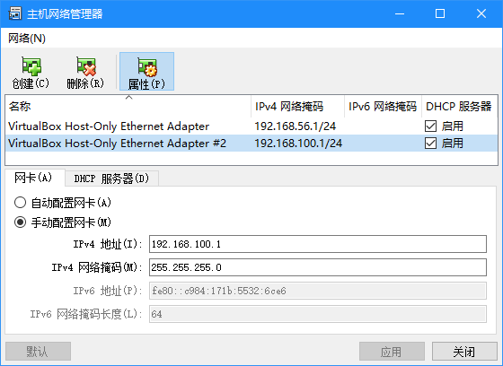
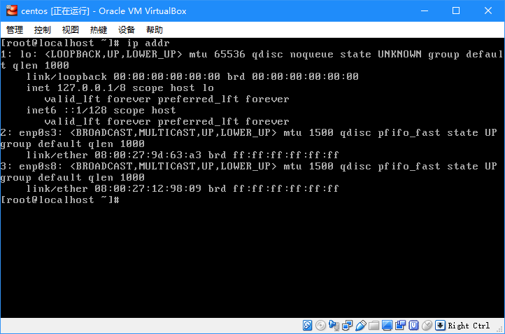
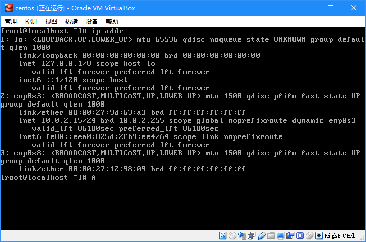
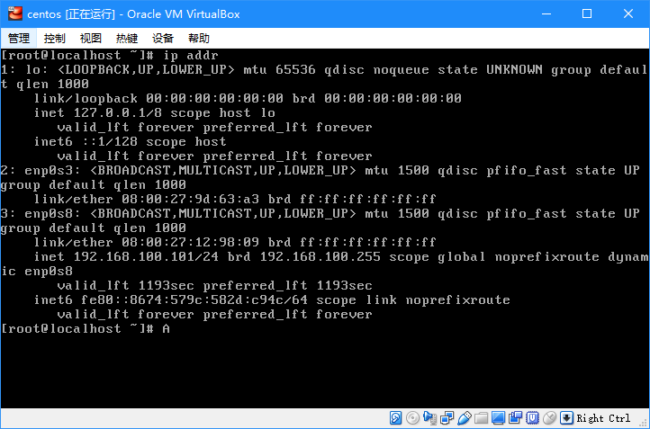
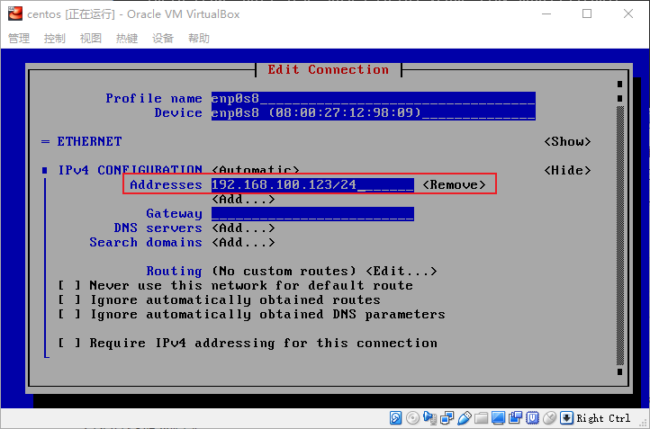
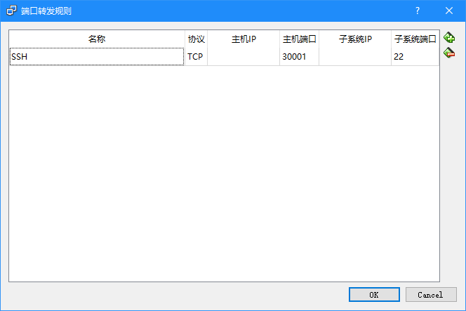
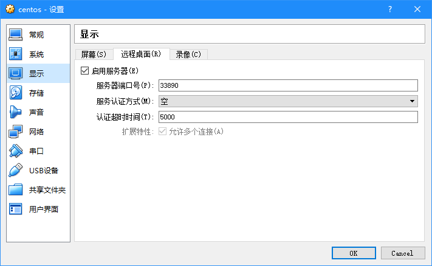

本文为《服务计算(Service Computing on Cloud)》课程的实验笔记，主要记录了利用VirtualBox配置CentOS私有云的过程和一些细节性知识。

<!-- more -->

## 前言

本次实验的主要内容是利用VirtualBox让PC提供云桌面服务，目的是初步了解虚拟化技术和云相关概念。

上个学期的实训课程，因为需要用上Linux，而本人不想折腾双系统和虚拟机，就利用WSL搭建了图形化Linux，并且通过RDP远程(详情参考[Windows | Linux子系统配置安装Xubuntu图形界面](https://icytown.com/windows/windows-subsystem-for-linux-gui-xubuntu/))，我个人也认为这也属于一种私有云。不过既然课程要求虚拟机实验，那么本次就尝试用VirtualBox配置私有云吧。

## 软件、环境准备

### 硬件虚拟化支持

虚拟机的运行需要硬件虚拟化技术的支持，这里涉及到的虚拟化技术是AMD-V或Intel-VT-x。在配置私有云之前请确保BIOS中相关的虚拟化技术已经被启用，如果没有，请靠搜索引擎查看具体机型如何进入BIOS界面。

[扩展](https://en.wikipedia.org/wiki/X86_virtualization)一下，AMD-V和Intel-VT-x是CPU级别的虚拟化；而在GPU领域，Intel有Intel-GVT-d、Intel-GVT-g、Intel-GVT-s等虚拟化技术；芯片组内存、IO管理上，也有AMD-Vi、Intel-VT-d等虚拟化技术。

### 虚拟机软件

虚拟机软件有VirtualBox、VMware Workstation等，本实验将采用VirtualBox，该软件作为免费开源软件，可以在[官网](https://www.virtualbox.org/wiki/Downloads)自由下载。

本文编写时，VirtualBox最新版本为5.2.18。

### Linux发行版镜像

Linux有众多的发行版，本文采用CentOS Minimal ISO，[在此下载](https://www.centos.org/download/)。

为什么选择CentOS呢？CentOS从本质上而言就是无支持版的RHEL，作为云服务端，在网络上有更加丰富的学习资料。其次，相比其它大多数发行版的源仓库只负责放包而不负责维护，商业化的RH系会更加及时跟进包的漏洞补丁(毕竟人数差异)。再则，RH系Linux相比其它发行版更加保守，因而更加稳定。(其实选择CentOS是因为习惯了)

不过，因为RH系过于保守，因此其包通常版本比较低，而类似Ubuntu这些发行版都比较追求新版本的包。

(PS：其实本来打算搞一下冰琳大佬的[AOSC OS](https://aosc.io/os-download)，后来想想还是算了)

## VirtualBox配置

安装好VirtualBox之后，需要配置一下VirtualBox的设定。

默认的VirtualBox虚拟机存储在系统盘用户目录，由于本人日常格式化重装系统，放在系统盘说不准分分钟被删掉，于是可以修改默认存储位置。通过`管理 -> 全局设定 -> 常规`，可以修改默认虚拟电脑位置。

同时，需要创建一个虚拟网卡，用于构成虚拟机内部虚拟网络，使得虚拟机与虚拟机之间、虚拟机与物理机之间可以通讯。通过`管理 -> 主机网络管理器`，创建虚拟网卡。



新的虚拟网卡配置为`192.168.100.1/24`，同时启用DHCP服务器，DHCP服务器均配置为`192.168.100.x`。通过Powershell来检查虚拟网卡是否配置成功。

```sh
$ ipconfig

...

以太网适配器 VirtualBox Host-Only Network:

   连接特定的 DNS 后缀 . . . . . . . :
   本地链接 IPv6 地址. . . . . . . . : fe80::1de8:d41e:fb26:40ce%46
   IPv4 地址 . . . . . . . . . . . . : 192.168.56.1
   子网掩码  . . . . . . . . . . . . : 255.255.255.0
   默认网关. . . . . . . . . . . . . :

以太网适配器 VirtualBox Host-Only Network #2:

   连接特定的 DNS 后缀 . . . . . . . :
   本地链接 IPv6 地址. . . . . . . . : fe80::c984:171b:5532:6ce6%55
   IPv4 地址 . . . . . . . . . . . . : 192.168.100.1
   子网掩码  . . . . . . . . . . . . : 255.255.255.0
   默认网关. . . . . . . . . . . . . :
   
...

```

其实安装完VirtualBox已经自动创建了一个虚拟网卡，而我们也可以仅使用那个网卡，仅需要将该网卡的地址分配为`192.168.100.1/24`。

## 私有云搭建

### 创建Linux虚拟机

点击VirtualBox中的`新建`，将弹出新建虚拟电脑向导。虚拟机名称输入`centos`，可自动识别成Linux类型和Red Hat版本(CentOS即为RH系)。

* 内存：默认1GB，对于Minimal已经够用了。
* 虚拟硬盘：VirtualBox磁盘映像，动态分配，30GB，鉴于之前服务器重装系统硬盘小于20G重装失败了。

创建虚拟电脑成功后，进入虚拟电脑的`设置 -> 网络`界面，网卡1保持为网络地址转换(NAT)，启用网卡2，设为仅主机(Host-Only)网络，且选择此前创建的虚拟网卡。


首次开启虚拟电脑，会提示选择启动镜像。选择此前下载的CentOS镜像，安装CentOS 7(此界面会有VGA颜色错误，不知道是什么原因)。进入CentOS安装向导界面之后，首先选择语言-English(别尝试选择中文，Ubuntu血的教训)。

在向导界面中，可以连接两个虚拟网卡，从而指定安装源(默认为本地镜像)。安装开始之前需要指定安装的目标硬盘，指定后会自动分区，然后可以继续安装了。在安装过程中，会提示设置ROOT管理员密码，需要设置，而普通用户无需创建。

安装完成后，使用`root`作为用户名，输入密码，即可登录CentOS。

### 配置动态IP网络

前面我们设置了两个网卡，分别为NAT和Host-Only，这两个网卡有什么用呢？

NAT全称为网络地址转换(Network Address Translation)，是一种在IP数据包通过路由器或防火墙时重写来源IP或者目的IP地址的技术。现在基本所有路由器都用了这种技术，本质上可以将多台只具有局域网地址的主机仅通过一个外网IP来访问因特网。

在物理机和虚拟机之间采用NAT技术，其实就相当于将物理机当作成路由器，而虚拟机相当于连接到这个路由器上的一台设备。物理机充当了路由器的功能，作为虚拟机访问因特网的中转站，提供了虚拟机上网功能。

但是在纯NAT网络下，物理机是无法访问虚拟机的。在Host-Only网络下，会构建一个独立的、全封闭的虚拟网络，网络中仅有主机和虚拟机，两者可以相互访问。

我们可以利用`ip`来查看网卡状况。

```sh
$ ip addr
```



第一个网卡`lo`即localhost的缩写，即`127.0.0.1`，第二个网卡`enp0s3`为NAT模式，第三个网卡`enp0s8`为Host-Only模式，这里仅指明本人虚拟机的网卡信息，不同构建的虚拟机可能网卡名称不一致。

网卡默认都是关闭的，我们需要设置让其开机自动连接。Network Manager所提供的Text UI工具`nmtui`可以很方便地设置网卡。

```sh
$ nmtui
```

通过`Edit a connection -> enp0s3/enp0s8`，将`Automatically connect`打上×即可让其在系统启动时自动连接。通过`Activate a connection`可以开启或关闭一个网卡连接。

当然，`nmtui`本质上也是直接修改本地的网卡配置，因此我们也可以利用`vi`去修改`/etc/sysconfig/network-scripts`文件夹中的文件，诸如`ifcfg-lo`、`ifcfg-enp0s3`、`ifcfg-enp0s8`。

现在我们开启NAT模式的网卡`enp0s3`，查看网络状况。

```sh
$ ip addr
```



现在我们来查看一下NAT是否能正常工作。

```sh
$ ping icytown.com
```

关闭NAT模式的网卡`enp0s3`，开启Host-Only模式的网卡`enp0s8`，查看网络状况。

```sh
$ ip addr
```



现在我们来查看一下Host-Only是否能正常工作，还记得我们之前创建的虚拟网卡ip吧。之前创建的虚拟网卡为`192.168.100.1`，那么在Host-Only网络中，物理机ip为`192.168.100.1`，而虚拟机ip在上述`ip`命令返回的结果中可以查询。其值为虚拟网卡DHCP服务器规定的ip范围内，在本人实验中为`192.168.100.101`。

在虚拟机中ping物理机。

```sh
$ ping 192.168.100.1
```

在物理机中ping虚拟机。

```sh
$ ping 192.168.100.101
```

需要注意的是，Host-Only网络中的流量可能被防火墙拦截。在NAT模式存在的时候，虚拟机ping物理机可能是走了NAT模式的流量。

好了，现在将两个网卡均开启，就能正常使用网络了。

### 配置静态IP网络

上一小节的标题为配置动态IP网络，IP由DHCP动态分配。但是动态分配不利于私有云构建，我们通常有IP固定的需求。这时，需要给虚拟机分配静态固定的IP。

利用`nmtui`可以很方便地设置虚拟机的静态IP，`Edit a connection -> enp0s8`。



填写ipv4的地址即可，但是要注意该地址必须在虚拟网卡DHCP服务器分配的IP范围内。随后重启网络服务。

```sh
$ service network restart
$ ip addr
```

这时候发现`enp0s8`分配的IP已经变为了`192.168.100.101`和`192.168.100.123`，前者是由DHCP动态分配的不固定的IP，后者是静态指定的固定IP。如果不想需要前者，可以关闭虚拟网卡的DHCP服务器。需要注意的是静态IP必须保证其在网络中的唯一性，否则会发生冲突。

为了方便，我们甚至可以将这个IP添加进hosts记录中。

```
192.168.100.123  centos
```

然后就可以愉快地使用`centos`作为虚拟机的标识了。

```sh
$ ping centos
```

### 配置SSH

虚拟机折腾到现在，其实相信大家已经发现最大的弊端了。由于VGA的缘故，系统显示的文字就这么大，而且没法翻回去查看此前的记录。甚至有些情况命令返回的信息是很长的，由于没法翻页导致部分信息被截取。利用SSH可以在外部访问虚拟机，创建新的终端，效果会好很多。

CentOS 7自带openssh的相关库、客户端、服务端等包，可以在物理机尝试利用SSH访问虚拟机。

```sh
$ ssh root@centos
```

这里的`centos`是上一节我们添加的hosts记录，亦可以直接使用IP。这时候你可能会发现SSH提示你是否存储ECDSA key了，提示你输入密码了。是的，本人第一次使用SSH的时候发现CentOS已经配置好了，可以直接用了。(异常尴尬)

不过，我们仍需要按部就班把步骤写下去。开启SSH功能需要先编辑`/etc/ssh/sshd_config`文件，将下面两行配置信息取消注释。

```
# Port 22
# PermitRootLogin yes
```

然后重启SSH服务。

```sh
$ service sshd restart
```

假装SSH从不能工作变成能工作。

至此，虚拟机可以采用无界面启动了。

## 私有云扩展

### 更换软件源

`yum`是CentOS自带的rpm包管理工具，用于软件包管理。不过默认的软件源为CentOS官方网站，其速度肯定不如国内的软件源，因此我们选择更换软件源。

国内比较著名的有[阿里云源](https://opsx.alibaba.com/mirror)，教育网内比较著名的是清华的[TUNA源](https://mirrors.tuna.tsinghua.edu.cn/)。如果在教育网体系内不妨试试TUNA软件源，毕竟支持ipv6，这里我就采用阿里云软件源了。

首先备份原来的软件源配置文件。

```sh
$ mv /etc/yum.repos.d/CentOS-Base.repo /etc/yum.repos.d/CentOS-Base.repo.bak
```

然后下载软件源配置文件。

```sh
$ curl -o /etc/yum.repos.d/CentOS-Base.repo http://mirrors.aliyun.com/repo/Centos-7.repo
```

生成缓存。

```sh
$ yum makecache
```

更新本地软件。

```sh
$ yum upgrade
```

### 安装VirtualBox增强功能

VirtualBox增强功能类似于VMware Tools，允许虚拟机有更高的分辨率，提供更好的鼠标、键盘服务，同时支持剪贴板共享。

首先安装所需工具。

```sh
$ yum install -y kernel-devel kernel-header gcc bzip2
```

重启虚拟机。

```sh
$ reboot
```

在虚拟机界面上选择`设备 -> 安装增强功能`，此时虚拟机会挂载增强功能的镜像，然后挂载CDROM。

```sh
$ mkdir /mnt/cdrom
$ mount /dev/cdrom /mnt/cdrom
```

安装增强功能。

```sh
$ /mnt/cdrom/VBoxLinuxAdditions.run
```

### 镜像备份

VirtualBox提供了复制现有虚拟机的功能，可以将现有的虚拟机复制一份以作备份，以避免以后需要重新安装系统的情况发生。需要注意，复制虚拟机必须选择重新初始化所有网卡的MAC地址。

复制之后的虚拟机必须修改分配的静态IP，不然会产生冲突问题。

## 私有云部署

将虚拟机暴露到外网需要将虚拟机映射到物理机上，物理机如何暴露到外网那就是跟我们没有关系了。

就本人情况而言，本人物理机在路由器NAT下，可以通过路由器端口转发暴露在校园网中。而身处校园网，我们无法获得公网IP，通常需要类似Frp的工具将公网服务器和内网服务器连接起来，从而暴露内网服务器。

如果没有公网IP，那么公益项目[Sakura Frp](https://natfrp.org)是一个不错的选择，本人就用其来搭建Minecraft服务器。

关于外网访问具体可以参考[Linux | CentOS 虚拟机私有云环境搭建](https://blog.zhenly.cn/Linux/linux_virtualbox/)，本节只介绍如何虚拟机映射到物理机上。

### 利用端口转发映射

选择你的虚拟机，`设置 -> 网络`，选择连接方式为NAT的网卡1，在其高级设置中进入端口转发设置页面。



这样就将虚拟机的22端口映射到了物理机的30001端口，然后本地`ipconfig`获取物理机的IP地址，通过SSH远程访问。

```sh
$ ssh -p 30001 root@192.168.1.205
```

当然，通过物理机和虚拟机相互构成的虚拟网络IP`192.168.100.1`访问也是可以的。如果出现连接被重置的问题，那估计是端口冲突，请更换主机端口。

### 利用VRDP映射

VirtualBox Remote Desktop Protocol(VRDP)是VirtualBox提供的远程工具，支持微软的远程桌面协议RDP。利用VRDP可以直接使用RDP协议访问虚拟机，而不需要在Linux上安装支持RDP协议的工具，比如xrdp等(因为Linux原生不支持RDP)。

VRDP被包含在Oracle VM VirtualBox Extension Pack中，并不内置在VirtualBox中。我们需要在[官网](https://www.virtualbox.org/wiki/Downloads)下载与VirtualBox版本相同的Extension Pack，然后安装扩展包。

随后`设置 -> 显示 -> 远程桌面`，选择启用服务器，自定义一个除了3389之外的任意服务器端口号，服务认证方式选择空。



打开Windows自带的远程桌面连接，输入主机IP加端口号`33890`，即可远程访问虚拟机了。

不过在服务认证上有个问题，外部和子系统服务认证都导致Windows RDP无法访问虚拟机，而不选择服务认证又将导致任何人都能访问虚拟机(尴尬~)。

## 结语

实际上，我们只是搭建了一台Linux虚拟机，但是从云的角度上看，如果有多台虚拟机共同工作，按照本节所涉及到的网络知识，是可以构成一个集群的。

那本文就结束啦~逃~

