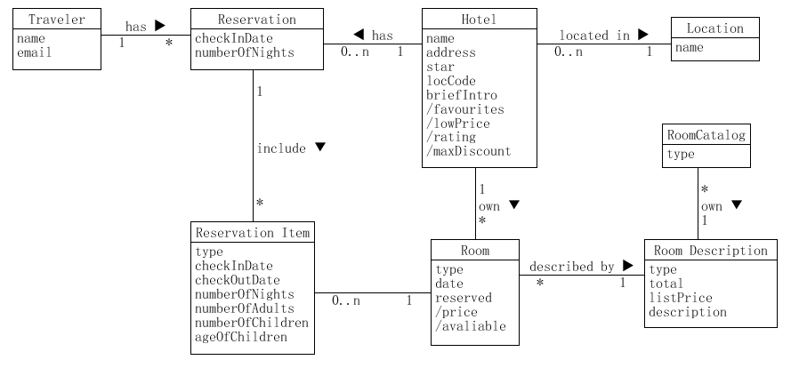
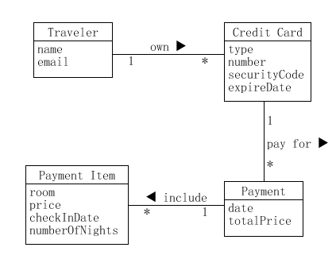
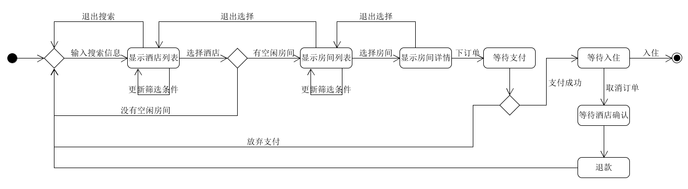

本文为《系统分析与设计》课程作业，探讨一下软件项目中的领域建模。

<!-- more -->

## 领域建模

### 实例：Asg-RH Make Reservation

其数据建模如下：

* Traveler(ID/Key, name, email)
* Reservation(ID/Key, TravelerID/FKey, HotelID/FKey, checkInDate, numberOfNights)
* ReservationItem(ID/Key, ReservationID/FKey, RoomID/FKey, type, checkInDate, checkOutDate, numberOfNights, numberOfAdults, numberOfChildren, ageOfChildren)
* Hotel(ID/Key, name, address, star, locCode, briefIntro, favourites, lowPrice, rating, maxDiscount)
* Location(ID/Key, HotelID/FKey)
* Room(ID/Key, HotelID/FKey, type, date, reserved, price, avaliable)
* RoomDescription(ID/Key, RoomID/FKey, type, total, listPrice, description)
* RoomCatalog(ID/Key, RoomDescriptionID/FKey, type)

### 实例：Asg-RH Payment

其数据建模如下：

* Traveler(ID/Key, name, email)
* CreditCard(ID/Key, TravelerID/FKey, type, number, securityCode, expireDate)
* Payment(ID/Key, CreditCardID/FKey, date, totalPrice)
* PaymentItem(ID/Key, PaymentID/FKey, room, price, checkInDate, numberOfNights)

## 状态建模

### 实例：Asg-RH Reservation/Order

