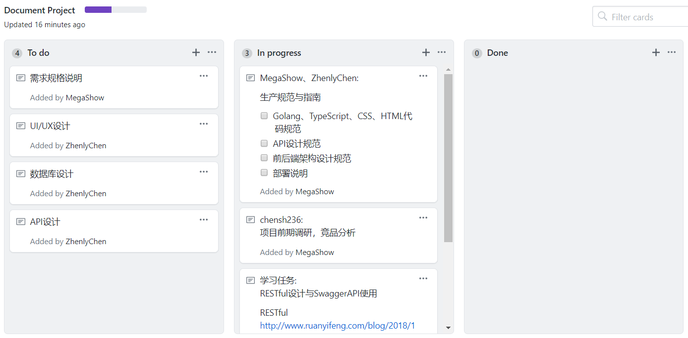
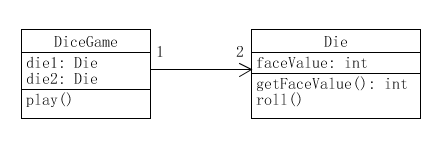

本文为《系统分析与设计》课程作业，探讨一下软件工程科学、软件项目管理简单实践与UML绘图。

<!-- more -->

## 分析与设计

分析强调的是对问题和需求的调查研究，而不是解决方案。

设计强调的是满足需求的概念上的解决方案，而不是其实现。

## 面向对象的分析与设计

在面向对象分析过程中，强调的是在问题领域内发现和描述对象或概念。在面向对象设计过程中，强调的是定义软件对象及它们如何协作以实现需求。

面向对象的分析与设计的优势在于通过建模语言能有效地将分析与设计结合在一起，降低开发的复杂性。

## 统一建模语言UML

统一建模语言(UML)是描述、构造和文档化系统制品的可视化语言。

UML的最大作用就是可视化，因其可视化语言的功能，UML可细分为三类作用：

* UML作为草图：用于探讨问题或解决方案空间的复杂部分。
* UML作为蓝图：易于理解现有代码，也可用于代码生成。
* UML作为编程语言：用于完成软件系统可执行规格说明。(理论上)

UML视图类型众多，大致可分为4类：

* 用例图
* 静态图
  * 类图
  * 对象图
  * 包图
* 行为图
  * 交互图
    * 顺序图
    * 合作图
  * 状态图
  * 活动图
* 实现图
  * 构件图
  * 部署图

## 软件范围(需求)控制

由于软件本身的复杂性、不可见性、不一致性、可变性，软件范围多数情况下对于客户和开发者都是模糊的。

但是根据2/8法则，如果细化20%的有效需求，即可满足80%的客户需求。因此，很多时候只要正确发现并做好这20%正确的事情，获取正确的20%的需求并细化，即可更好满足客户需要，因此也可以以更少的付出、更短的周期获得更多客户。因此，软件范围控制是可行的。

## 团队管理 - 看板Kanban

使用看板来管理团队需求，可以很方便地给成员分配任务，也能将需求任务分为To Do、In Progress、Done等分类，便于开发。

GitHub的Project功能提供了看板来团队管理，不过它的功能是很少的，甚至不如Trello、Teambition之类的工具。我个人觉得，它的最大的优势就是可以和Issue、Pull Request链接。当然，也有一些不错的GitHub App工具，比如ZenHub，是基于Project的插件类工具。

## UML绘图工具使用 - UMLet

UMLet是一个简易、免费、开源的UML绘图工具。

这里，我们将《UML和模式应用 3rd》第7页图1-5通过UMLet绘制出来。

