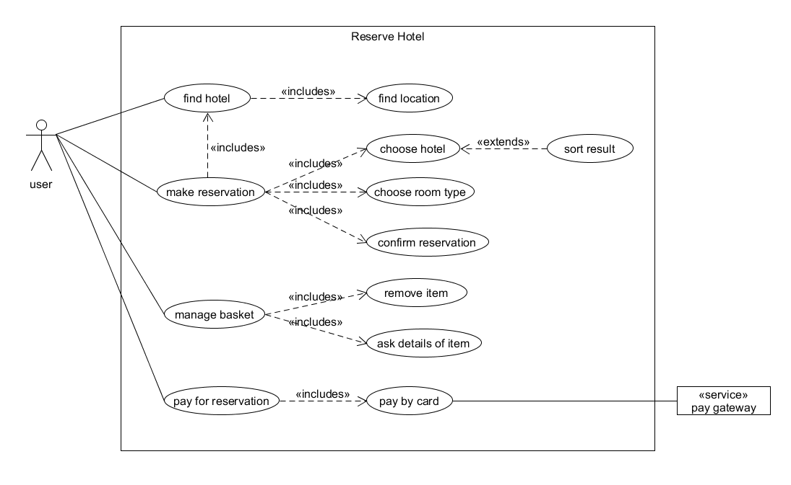
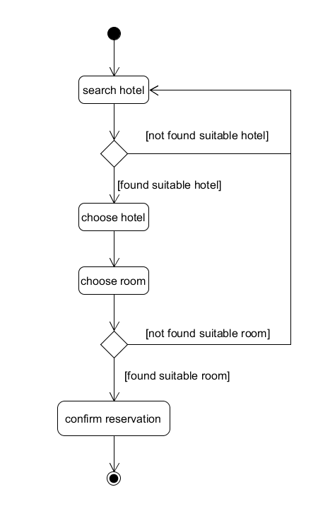
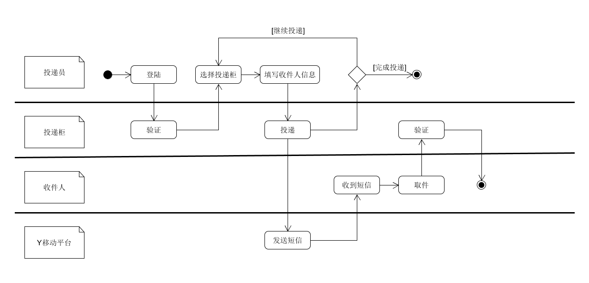
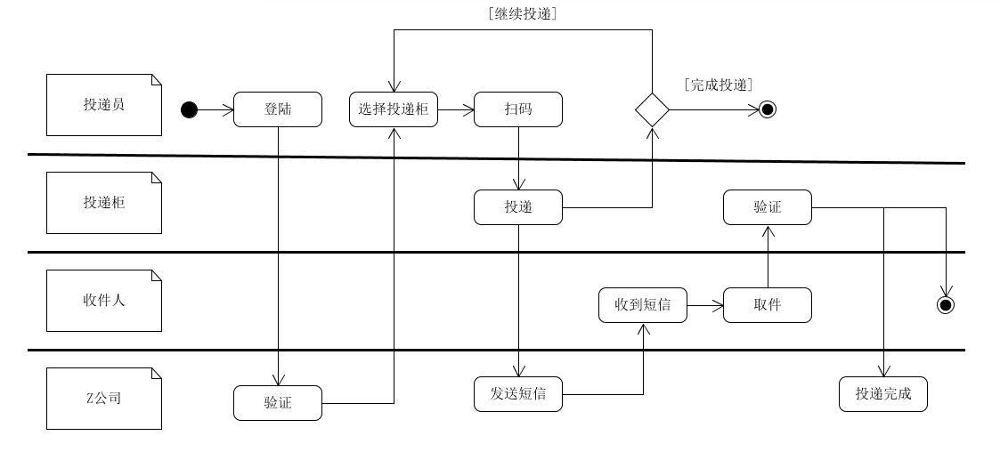
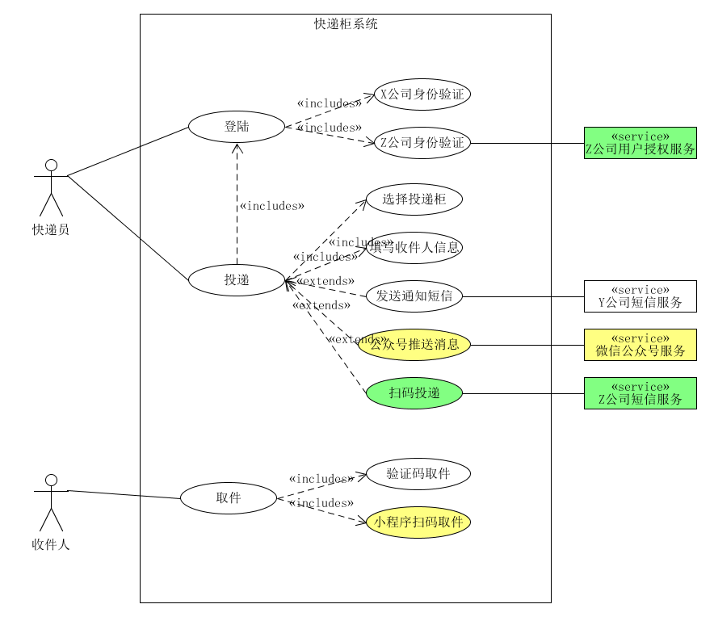

本文为《系统分析与设计》课程作业，探讨一下软件项目中的用例建模与业务建模方法。

<!-- more -->

## 实例：Asg-RH

### 用例图模型

### make reservation的活动图

## 实例：投递员使用投递箱给收件人快递包裹

### 多泳道图建模

场景一：X科技公司发明了投递柜，它们自建了投递柜以及远程控制系统。注册的投递员在推广期免费使用投递柜。由于缺乏资源，仅能使用y移动平台向客户发送短信通知。

场景二：随着产品推广，X公司与各大快递z公司达成协议。X公司在快递柜上添加了二维码扫描装置，Z公司的快递员不仅可在快递柜上登陆（由Z公司提供认证服务），且可扫描快递单号，投递入柜后自动由Z公司发短信给客户。客户取件后，自动发送给Z公司投递完成。

场景三：X公司进一步优化服务，开发了微信小程序实现扫码取快递。如果用户关注了该公司公众号，直接通过过公众号推送给用户取件码等信息。不再发送短信。

### 用例图模型

- 用正常色彩表示第一个业务流程反映的用例
- 用绿色背景表述第二个业务场景添加或修改的用例，以及支持 Actor
- 用黄色背景表述第三个业务场景添加或修改的用例，以及支持 Actor

