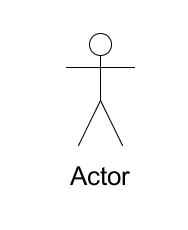
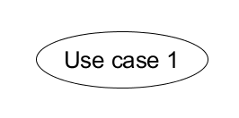
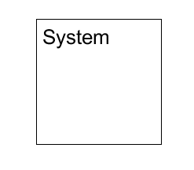
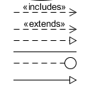
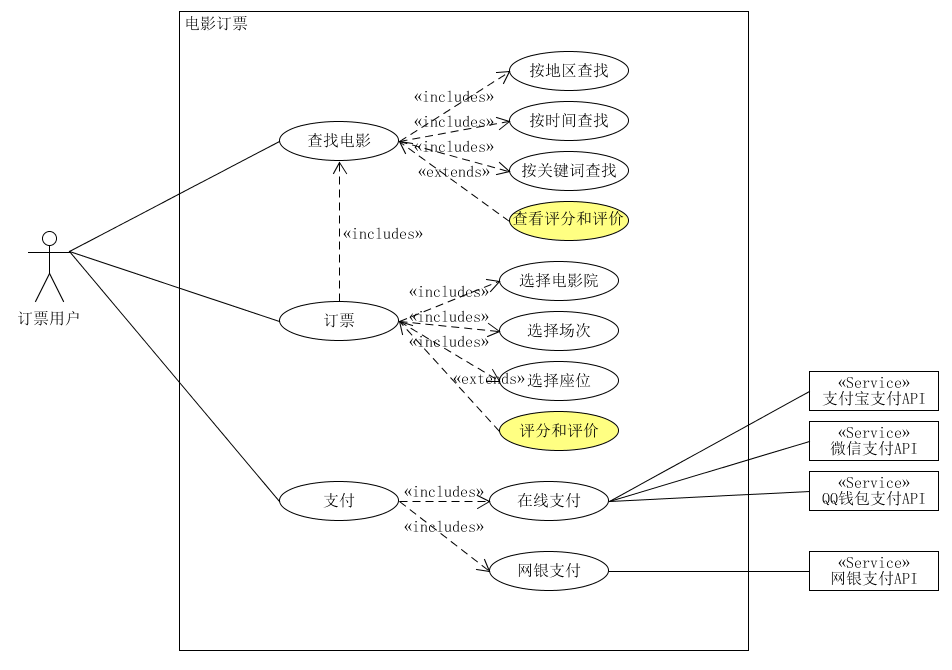
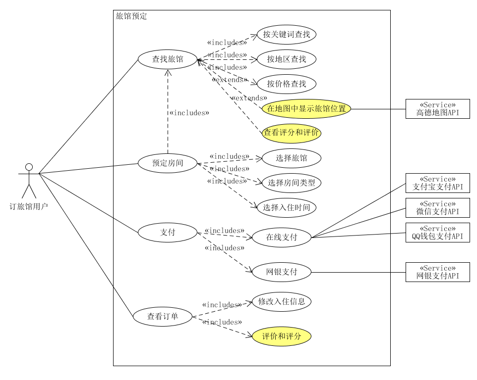

本文为《系统分析与设计》课程作业，探讨一下软件项目中的用例建模与用例图绘制。

<!-- more -->

## 用例建模

### 什么是用例？

用例是软件工程或系统工程中对系统如何反应外界请求的描述，是一种通过用户的使用场景来获取需求的技术。

每个用例提供了一个或多个场景，该场景说明了系统是如何和最终用户或其它系统互动，从而获得一个明确的业务目标。

### 用例和场景的关系？什么是主场景或happy path？

一个用例提供了一个场景或多个场景，即用例包含了场景，而场景也可以被称为用例的一个实例。

用例可以是一个场景，也可以是一组场景。其中用例包含一个主场景，是指用例的目标完成的主要步骤组成的场景，即从事件开始一步步执行下去最终满足用户的目标，也被称为happy path。

### 用例的形式

用例可以根据不同细度分为三种书写形式：

* **摘要：**由简短的句子来组成总结性的用例，适合用于计划软件开发。
* **非正式：**由文本段落组成，用总结或故事的形式详细地描述用例。
* **完整正式：**以包含了不同部分的长模板为基础的正规的文档。

### 对于复杂业务，为什么编制完整用例非常难？

对于复杂业务，其功能和需求也是极其复杂的，因此通常业务所需要的用例场景也是非常多，场景与场景的关系也是交错复杂。在给复杂业务编制完善用例的时候，必须对整个业务的各个模块深入了解，必须分析出各个模块之间的关系。

其次，如果业务的需求发生更改，那用例的修改也是一个比较大的工程。对于复杂业务，还需要考虑到开发人员数量大，且可能出现人员变动，这些都会导致编制完整用例的难度增大。

### 什么是用例图？

用例图是指由参与者、用例、边界以及它们之间的关系构成的用于描述系统功能的视图，是外部用户所能观察到的系统功能的模型图。

简单而言，用例图即系统蓝图，可以呈现一些参与者、用例以及它们之间的关系，对系统、子系统或类的功能行为进行建模。

### 用例图的基本符号与元素

* 参与者：指系统以外的，在使用系统或与系统交互中所扮演的角色。

* 用例：指对包括变量在内的一组动作序列的描述。

* 系统边界：用来标识建模系统的边界。

  

* 箭头：用来表示参与者和系统通过相互发送信号或消息进行交互的关联关系。

### 用例图的画法与步骤

1. 确定研讨的系统
   * 使用System框确定系统边界
   * 正确命名系统或子系统
2. 识别参与者
   * 识别使用系统的主要参与者/角色
     * 使用Actor符号表示，通常放在系统的左边
     * 识别业务角色与职责
   * 识别系统依赖的外部系统
     * 使用Neighbor System框表示用例依赖的外部系统、服务、设备，并使用构造型(Stereotype)识别
3. 识别用例
   * 识别用户级别用例
   * 识别子功能级别的用例
4. 建立参与者和用例之间的关系
   * 使用无方向连线，表示两者之间是双向交互的协议

### 用例图的价值

* 明确系统的业务范围、服务对象、外部系统与设备
* 帮助识别技术风险，提前实施关键技术原型公关与学习
* 易于评估项目的工作量，合理规划迭代周期，规划人力需求

## 用例图绘制

### 用例图案例

用例图要求：

- 请使用用户的视角，描述用户目标或系统提供的服务
- 粒度达到子用例级别，并用 include 和 exclude 关联它们
- 请用色彩标注出你认为创新（区别于竞争对手的）用例或子用例
- 尽可能识别外部系统和服务

电影订票系统：

旅馆房间预定系统：

### 为什么相似系统的用例图是相似的？

因为对于相似的系统来说，它们所具有的功能和需求也是相似的，因此它们的用例图也是相似的。比如电影订票系统和旅店预定系统，都是围绕订票、预定所展开的功能，都需要有相似的搜索功能、订阅功能、查看订单、修改订单等功能。因此，它们的用例图是大致相同的。而不同点也是它们需要针对自己的领域加入新的创新元素以增加自己的竞争能力。

### 如何利用不同时代、地区产品的用例图，展现、突出创新业务和技术？

不同时代和不同地区之间会有一些地区特色或者时代特色的用例或者场景，通过对比这些用例图，可以根据不同的场景和用例推测出该时代或地区具有创新或实用的业务和技术。比如现在的旅馆预定系统都支持在线支付，比如网银或者支付宝等支付手段，而早些日子的用例图只有网银支付甚至没有在线支付的手段。

### 如何利用用例图定位创新思路在系统中的作用？

根据用例图中用例所在的位置以及该用例与其他用例之间的关系可以定位该用例创新之处在系统中的作用。一个重要的创新业务或技术必定在用例图中与其他用例关系密切且处于重要的位置。通过分析他人的用例图，也可以很快的定位该产品的重要创新思路，来改进自己的产品。

### 需求开发计划表和项目用例点估计

使用SCRUM方法，选择一个用例图，编制某定旅馆开发的需求开发计划表，并给出项目用例点的估计。

需求开发计划表如下：

|  Id  |   Name   | Imp  | Est  |               How to demo                |
| :--: | :------: | :--: | :--: | :--------------------------------------: |
|  0   | 用户管理 |  20  |  10  |     用户注册、登陆，用户个人信息管理     |
|  1   | 查找旅馆 |  60  |  30  | 根据地区、价格、关键词等信息进行旅馆搜索 |
|  2   | 预定房间 |  60  |  30  |     选择房间类型、数量、旅馆、餐饮等     |
|  3   |   支付   |  50  |  20  |           用户对预定的房间支付           |
|  4   | 订单管理 |  30  |  15  |      用户申请修改订单信息或评价评分      |

项目用例点估计如下：

|   用例   | 业务 | 计算 |                             原因                             | UC权重 |
| :------: | :--: | :--: | :----------------------------------------------------------: | :----: |
| 用户管理 |  6   |  5   |       用户注册、登陆、信息管理，需要邮箱或手机短信服务       |  一般  |
| 查找旅馆 |  10  |  7   | 根据地区、价格、关键词等信息进行旅馆搜索，同时需要在地图上显示旅馆地址 |  一般  |
| 预定房间 |  5   |  4   |               选择房间类型、数量、旅馆、餐饮等               |  简单  |
|   支付   |  8   |  4   |                     用户对预定的房间支付                     |  一般  |
| 订单管理 |  5   |  3   |                用户申请修改订单信息或评价评分                |  简单  |

