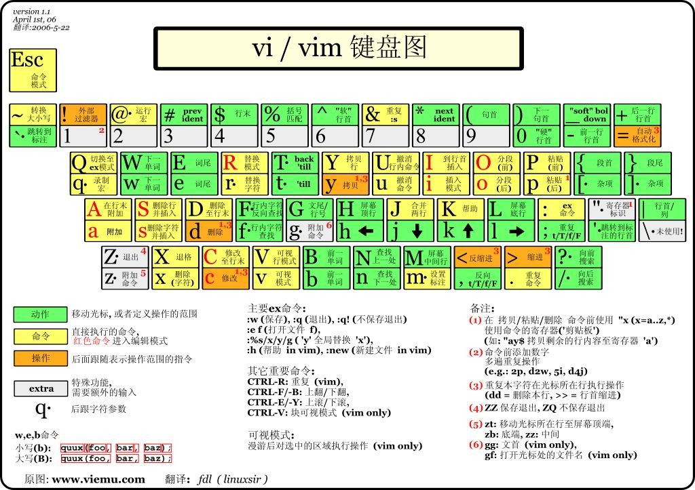

Vi是一个文本编辑器，其名字来源于`Visual`。Vim是Vi的改良版本，功能比Vi强大得多，其名字来源于`Vi IMitation`，内置于几乎所有Unix和Linux系统。现在在大部分Linux中`vi`和`vim`都是指向`vim`。

<!-- more -->

```sh
$ which vi
/usr/bin/vi

$ ls -l /usr/bin/vi
lrwxrwxrwx 1 root root 20 Sep 23  2017 /usr/bin/vi -> /etc/alternatives/vi

$ ls -l /etc/alternatives/vi
lrwxrwxrwx 1 root root 18 Sep 23  2017 /etc/alternatives/vi -> /usr/bin/vim.basic

$ ls -l /usr/bin/vim.basic
-rwxr-xr-x 1 root root 2437320 Nov 25  2016 /usr/bin/vim.basic
```



## Vi基本模式

### 命令行模式

Vi在命令行模式(command mode)下可以做光标移动、字符和行的删除、复制移动等操作。

命令行模式可以直接切换到插入模式(insert mode)和底行模式(last line mode)。

### 插入模式

插入模式就是编辑模式，只有在插入模式才能对文本进行编辑。

在命令行模式下按`i`、`o`、`a`按钮均可以进入插入模式，在插入模式下按`ESC`按钮可以回到命令行模式。

### 底行模式

底行模式就是在Vi最下面一行需要输入命令的模式，做文件保存、退出Vi、搜索等操作。个人认为底行模式其实算是命令行模式，底行模式和命令行模式其实没有明显可以区分的定义。

底行模式又叫作ex模式，执行以`:`开头的ex命令。

### 可视模式/可视行模式

可视模式/可视行模式可以归类于命令行模式。

可视模式可以以字符作为单位对文本选中，可视行模式可以以行为单位对文本选中。

### 替换模式

替换模式可以归类于插入模式，只不过其编辑是替换编辑。

### 宏模式

宏模式录制宏和运行宏。

## Vi文件操作

Vi的启用：

```
$ vi         # 启动Vi
$ vi main.c  # 启动Vi, 并打开文件main.c
```

Vi的保存和退出：

|     命令      |            备注            |
| :-----------: | :------------------------: |
|     `:q`      | 直接退出，未保存时退出失败 |
|     `:q!`     |          强制退出          |
|     `:w`      |            保存            |
| `:w filename` |       另存为filename       |
|     `:wq`     |         保存并退出         |

## Vi光标操作

### 模式切换

|   命令    |       源模式        |      目的模式       |           备注            |
| :-------: | :-----------------: | :-----------------: | :-----------------------: |
|    `i`    |     命令行模式      |      插入模式       |     光标位于当前位置      |
|    `a`    |     命令行模式      |      插入模式       |    光标位于下一个位置     |
|    `o`    |     命令行模式      |      插入模式       |     光标位于新行行首      |
|   `ESC`   |      插入模式       |     命令行模式      |                           |
|  `ESC`*2  | 可视模式/可视行模式 |     命令行模式      |                           |
|  `v`/`V`  |     命令行模式      | 可视模式/可视行模式 | 可视行模式也可`Shift`+`v` |
|  `:`/`Q`  |     命令行模式      |  底行模式(ex模式)   |                           |
| `q`+`(r)` |     命令行模式      |     宏录制模式      |   `(r)`为录制存储的按键   |
|    `R`    |     命令行模式      |      替换模式       |                           |

### 光标移动

* 移动格：`h`、`j`、`k`、`l`分别对应左、下、上、右，也可以直接用键盘方向键，`(n)l`可以向右移动(n)格。
* 移动页：`ctrl`+`b`/`f`/`u`/`d`分别对应向后移动一页、向前移动一页、向后移动半页、向前移动半页。
* 文内移动：`0`移动到文章开头，`G`移动到文章结尾。`ctrl`+`g`列出光标所在行行号，`#G`移动到第`#`行的行首。
* 行内移动：`$`移动到行尾，`^`移动到行首。 
* 字内移动：`w`跳到下个字的开头，`e`跳到下个字的结尾，`b`回到上个字的开头。


## Vi编辑操作

* 删除：`x`删除光标后一个字符，`X`删除光标前一个字符，`dd`删除光标所在行。这些命令均可以在前面加`(n)`，表示删除(n)个字符或(n)行。`cw`删除光标所在位置到字尾的字符，`c#w`删除所在位置开始的`#`个字符。
* 复制：`yw`复制光标所在位置到字尾的字符，`yy`复制光标所在行。这些命令均可以在前面加`(n)`，表示复制(n)个字符或(n)行。
* 粘贴：`p`
* 替换：`r`只替换光标所在字符，`R`进入替换模式
* 撤销：`u`


## Vi ex命令

|  ex命令   |       备注        |
| :-------: | :---------------: |
| `set nu`  |     显示行号      |
|    `#`    |    跳转到第`#`    |
| `/#`/`?#` | 搜索查找`#`字符串 |

