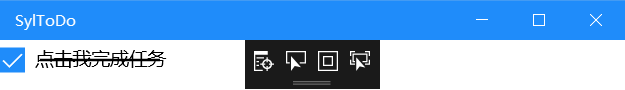
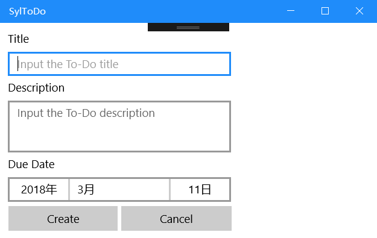

UWP应用开发系列文章是本菜秀在《现代操作系统应用开发(MOSAD)》课程上的作业笔记，旨在加深自己对UWP的认识，所以可能会排版无比奇葩。当然，这里不仅仅局限于课程上学到的东西，菜秀尽力分享更多东西。如果学疏才浅的菜秀有啥错误，欢迎指正。

本文是本系列的第一篇文章，重点是先初步认识UWP。

<!-- more -->

# UWP应用开发(1) UWP初探

[GitHub源码地址](https://github.com/MegaShow/SylTodo)

## 什么是UWP？

UWP，即Windows 10中Universal Windows Platform的简称，中文名为通用Windows平台。其旨在提供一个通用应用平台，统一微软众多产品的应用平台。简而言之就是，UWP应用可以在众多微软产品上运行，包括Windows 10、Windows Mobile、Xbox、HoloLens、Windows IoT。

相比普通的Win32应用或者.NET应用，UWP有着“多平台发布”的优势。不过UWP一直不愠不火，希望UWP能成为微软手里打好的好牌吧。(微软是出了名的打烂自己手里的好牌，然而架不住别人手里的好牌足够多。笑~)

我们平时常见的Win32应用微软官方规定的安装包为`msi`文件，而UWP安装包为`appx`文件。不过前些日子的Windows开发者日会议上，微软宣布合并`msi`和`appx`，新规定`msix`文件，看起来是下一步大棋。(微软：我改起名字连自己都害怕。笑~)

## 新建VS解决方案

UWP应用开发需要Visual Studio的支持，目前仅有VS2015、VS2017支持。这里建议使用VS2017，毕竟相比2015有质的飞跃。

安装好VS2017之后，新建项目，选择`Visual C#`，选定`空白应用(通用Windows)`。然后填写一些路径、解决方案名字等设置，就可以了。

### 解决方案与项目

在讲新项目常用文件之前，这里要普及两个概念：`项目`、`解决方案`。

在VS里面项目不等同于解决方案，解决方案是一个比项目大的概念，一个解决方案里面可以有多个项目。如果我们浏览刚刚我们创建的项目的目录，可以得到下面的文件树。

```
# 这里我创建的名字为SylToDo
SylToDo
  ├-SylToDo.sln
  └─SylToDo
      ├-SylToDo.csproj
      └─...
```

这里是一个名字叫`SylToDo`的解决方案，其配置文件储存在`SylToDo.sln`中。在这个解决方案里面，有一个叫`SylToDo`的项目，其配置文件储存在`SylToDo.csproj`中。虽然两个文件都是文本文件，不过`sln`文件比较难手动修改，而`csproj`是XML文件，修改起来很方便。通常我们采用VS或者`dotnet sln`对`sln`文件进行修改。

一个解决方案里面可以有多个项目，这样可以便于项目直接的相互引用，放在一起开发。当一个工程分成多个项目进行的时候，除去利用`NuGet`进行项目之间导入，将项目放在一个解决方案中不失为一个好方法，进行版本管理的时候也只需要一个repository。

### 新项目文件树

|         文件/文件夹         |                    任务                    |
| :--------------------: | :--------------------------------------: |
|       `Assets/`        | 资源文件夹，存储了应用的Logo图片。其中`StoreLogo.png`表示应用商店的应用，`SplashScreen.scale-200.png`是应用启动时初始屏幕，`Square150x150Logo.scale-200.png`表示开始菜单的应用，其余类似 |
|       `App.xaml`       |              声明应用中所使用的资源的位置              |
|     `App.xaml.cs`      | `App.xaml`的代码隐藏文件，是应用的入口，包含一个调用`InitializeComponent`方法的构造函数，该方法由VS生成，其主要作用是初始化在XAML文件中声明的元素。还包含一些处理应用激活和挂起的方法 |
|    `MainPage.xaml`     | 应用加载的初始画面，定义UI，与`MainPage.xaml.cs`一起定义称为`MainPage`的类，继承于`Windows.UI.Xaml.Controls`的`Page` |
|   `MainPage.xaml.cs`   | `MainPage.xaml`的代码隐藏页面，可以在其中添加应用逻辑和事件处理程序 |
| `Package.appxmanifest` | 描述应用的清单文件，包含应用的名称、描述、磁贴、起始页，同时包含应用包含的文件列表 |

## Week 1 Homework

* 在`MainPage`上放置`CheckBox`和`Line`两个控件，当`CheckBox`被勾选时`Line`出现，取消勾选则`Line`消失。
* 新建一个`NewPage`点击Create按钮时，检查Title、Description是否为空，Due Date是否正确(是否大于等于当前日期)。如果不正确，弹出对话框，显示错误信息。
* 点击Cancel按钮时，Title、Description置空，Due Date置为当前日期。

### Task 1

首先打开`MainPage.xaml`，点击左边的`工具栏`，选择XAML控件`CheckBox`，拖拉到可视化界面。通过调节右下角的属性，使得`CheckBox`满足下列的代码：

```xml
<CheckBox x:Name="CheckBox" Content="点击我完成任务" HorizontalAlignment="Left" VerticalAlignment="Top"/>
```

其次就是`Line`，因为`Line`不属于`Windows.UI.Xaml.Controls`，所有没法在XAML控件中直接拖拉。我们需要通过直接修改XAML代码来声明`Line`。

```xml
<Line x:Name="Line" X1="32" X2="128" Y1="16" Y2="16" Stroke="Black" StrokeThickness="2"/>
```

这个时候就会出现`Line`覆盖在`CheckBox`之上的效果。由于我们需要被勾选时`Line`出现的效果，所以我们需要设`Line`默认为不可见，然后给`CheckBox`添加事件。`Line`不可见的属性为`Visibility="Collapsed"`，`CheckBox`添加事件为`Click="CheckBox_Click"`。这里设置属性和事件都可以在右下角设置，其中右下角的“闪电”标志是调出事件设置窗口的，双击输入框就可以生成代码了。

在`MainPage.xaml.cs`中添加相关事件代码：

```csharp
private void CheckBox_Click(object sender, RoutedEventArgs e) {
    if (Line.Visibility == Visibility.Collapsed) {
        Line.Visibility = Visibility.Visible;
    } else {
        Line.Visibility = Visibility.Collapsed;
    }
}
```

然后执行程序：



#### Explanation

首先我们来看看`CheckBox`的代码，`CheckBox`位于命名空间`Windows.UI.Xaml.Controls`，这个命名空间专门提供各种UI控件。我们上面使用了`CheckBox`的4个属性，`x:Name`、`Content`、`HorizontalAlignment`、`VerticalAlignment`、`Click`。

|          属性           |                    详情                    |
| :-------------------: | :--------------------------------------: |
|       `x:Name`        | 如果一个标签带有`x:Name`属性，那么XAML编译器除了为这个标签声明相应的UI实例之外，还要声明一个引用变量，这个变量的名字就是`x:Name`的值。 |
|       `Content`       |                   文本内容                   |
| `HorizontalAlignment` | 位于`System.Windows`的枚举，值可为Center、Left、Right、Stretch |
|  `VerticalAlignment`  | 位于`System.Windows`的枚举，值可为Bottom、Center、Stretch、Top |
|        `Click`        |                   点击事件                   |

`Line`与`CheckBox`不在同一个命名空间，其在`Windows.UI.Xaml.Shapes`命名空间中，这个命名空间提供了各种非渲染式的基本形状类。我们看`Line`的`X1`、`X2`、`Y1`、`Y2`、`Stroke`、`StrokeThickness`、`Visibility`。

|         属性          |      详情       |
| :-----------------: | :-----------: |
| `X1`、`X2`、`Y1`、`Y2` | `Line`的端点XY坐标 |
|      `Stroke`       |      画笔       |
|  `StrokeThickness`  |     画笔的宽度     |
|    `Visibility`     |      可见性      |

`CheckBox`的事件`CheckBox_Click`方法提供了两个参数，`object sender, RoutedEventArgs e`。第一个参数是事件源，第二个参数是事件参数，比如点击事件中点击的位置。下面代码展示了如何利用事件源：

```csharp
private void CheckBox_Click(object sender, RoutedEventArgs e) {
    CheckBox checkBox = (CheckBox)sender;
    checkBox.Content = "完成的TODO";
}
```

### Task 2

首先在`项目`-`添加新项`中添加`空白页`，命名为`NewPage.xaml`。在工具箱里面拖拉`TextBox`、`DatePicker`和`Button`构建成基本页面之后，开始修改代码隐藏文件。

```xml
<Grid Background="{ThemeResource ApplicationPageBackgroundThemeBrush}">
    <TextBox x:Name="title" HorizontalAlignment="Left" Text="" VerticalAlignment="Top" Width="296" PlaceholderText="Input the To-Do title" Margin="10,10,0,0" AcceptsReturn="True" Header="Title"/>
    <TextBox x:Name="description" HorizontalAlignment="Left" Text="" VerticalAlignment="Top" Width="296" Height="97" TextWrapping="Wrap" PlaceholderText="Input the To-Do description" Margin="10,75,0,0" AcceptsReturn="True" Header="Description" ScrollViewer.VerticalScrollBarVisibility="Auto"/>
    <DatePicker x:Name="dueDate" HorizontalAlignment="Left" VerticalAlignment="Top" Margin="10,177,0,0" Header="Due Date"/>
    <Button Content="Create" HorizontalAlignment="Left" VerticalAlignment="Top" Width="145" Margin="11,243,0,0" Click="Button_Click"/>
    <Button Content="Cancel" HorizontalAlignment="Left" VerticalAlignment="Top" Margin="161,243,0,0" Width="146"/>
</Grid>
```

这里我们不考虑任何布局问题，不过要事先说明`Margin`不是一个好的布局解决方案。

```csharp
using Windows.UI.Popups;
```

点击事件实现：

```csharp
private void Button_Click(object sender, RoutedEventArgs e) {
    string output;
    if (title.Text.Length == 0) {
        output = "Title不能为空";
    } else if (description.Text.Length == 0) {
        output = "Description不能为空";
    } else if (dueDate.Date < DateTime.Now.Date) {
        output = "dueDate不合法";
    } else {
        output = "创建TODO成功";
    }
    MessageDialog msg = new MessageDialog(output);
    msg.ShowAsync();
}
```



#### Explanation

这里用了三个新控件，`TextBox`、`DatePicker`和`Button`。这个就不再对各种控件的属性作介绍了，如果想了解可以到[官网](https://docs.microsoft.com/zh-cn/uwp/api/)去查询。这里本该用`TextBlock`来实现文本显示，不过因为一一对应的关系，用了`TextBox`的`Header`属性替代它。设置`TextBox`支持多行需要`AcceptsReturn="True"`，同时建议设置`ScrollViewer.VerticalScrollBarVisibility="Auto"`。

在点击事件里面，我们用了一个类`MessageDialog`，这个类在`Windows.UI.Popups`命名空间中定义，需要引用该命名空间才能使用。`MessageDialog`用于创建计算机术语里面的对话框，跟`Win32`时代的`MessageBox`几乎一模一样。`MessageDialog`有两个构造函数，分别如下：

```csharp
public MessageDialog(String content)
public MessageDialog(String content, String title)
```

`MessageDialog`的`ShowAsync()`方法用于显示对话框。这是一个支持异步版本的方法，所以你也可以这样写，不过要声明`Button_Click`为`async`函数，类似`JavaScript`。

```csharp
await msg.ShowAsync();
```

`DateTime.Now`获得一个当前时间的`DateTime`实例，不过我们只需要比较Date，而不需要比较Time，所以通过这个实例的属性`DateTime.Now.Date`获取Date。

### Task 3

清零工作是最简单的，我们前面在Task 2里面已经创建了Cancel按钮，现在创建一个新的点击事件。

```csharp
private void Button_Click_1(object sender, RoutedEventArgs e) {
    title.Text = String.Empty;
    description.Text = String.Empty;
    dueDate.Date = DateTime.Now.Date;
}
```

#### Explanation

这里赋值空字符串用的是`String.Empty`，实际上现在的.NET里用`""`最终也会被实现成`String.Empty`，所以用哪个方法赋值空字符串都无所谓。

## Grid布局

单纯地使用`Margin`进行布局是一个不好的解决方案，UWP里面微软提供了很多很强大的布局方式。不过菜秀也是刚刚学习，所以这里只用了最简单的`Grid`布局。我们将NewPage的XAML文件改成如下：

```xml
<Page
    x:Class="SylToDo.NewPage"
    xmlns="http://schemas.microsoft.com/winfx/2006/xaml/presentation"
    xmlns:x="http://schemas.microsoft.com/winfx/2006/xaml"
    xmlns:local="using:SylToDo"
    xmlns:d="http://schemas.microsoft.com/expression/blend/2008"
    xmlns:mc="http://schemas.openxmlformats.org/markup-compatibility/2006"
    mc:Ignorable="d">

    <Grid Background="{ThemeResource ApplicationPageBackgroundThemeBrush}" Margin="30,30,30,30">
        <Grid.ColumnDefinitions>
            <ColumnDefinition Width="*"/>
            <ColumnDefinition Width="*"/>
        </Grid.ColumnDefinitions>
        <Grid.RowDefinitions>
            <RowDefinition Height="80"/>
            <RowDefinition Height="*"/>
            <RowDefinition Height="80"/>
            <RowDefinition Height="40"/>
        </Grid.RowDefinitions>
        <TextBox x:Name="title" Grid.Row="0" Grid.ColumnSpan="2" HorizontalAlignment="Stretch" Text="" VerticalAlignment="Center" PlaceholderText="Input the To-Do title" AcceptsReturn="True" Header="Title"/>
        <TextBox x:Name="description" Grid.Row="1" Grid.ColumnSpan="2" HorizontalAlignment="Stretch" Text="" VerticalAlignment="Stretch" PlaceholderText="Input the To-Do description" AcceptsReturn="True" Header="Description" ScrollViewer.VerticalScrollBarVisibility="Auto"/>
        <DatePicker x:Name="dueDate" Grid.Row="2" Grid.ColumnSpan="2" HorizontalAlignment="Stretch" VerticalAlignment="Stretch" Header="Due Date" MaxWidth="Infinity"/>
        <Button Grid.Row="3" Grid.Column="0" Margin="0,0,10,0" Content="Create" HorizontalAlignment="Stretch" VerticalAlignment="Stretch" Click="Button_Click"/>
        <Button Grid.Row="3" Grid.Column="1" Margin="10,0,0,0" Content="Cancel" HorizontalAlignment="Stretch" VerticalAlignment="Stretch" Click="Button_Click_1"/>
    </Grid>
</Page>
```

这是一个栅格布局，从11行到20行代码将应用布局分成2列、4行。利用`ColumnDefinitions`和`RowDefinition`来定义每一行和每一列的属性，其中有具体数字、Auto、`*`三种定义方式。

具体数字就是像素大小，不需要具体说明；Auto表示其值跟随行(或列)的长宽所决定；`*`表示比例。比如下列例子，表示按`5:3`来分割成两列，如果是`1*`，可以省略成`*`。

```xml
<Grid.ColumnDefinitions>
    <ColumnDefinition Width="5*"/>
    <ColumnDefinition Width="3*"/>
</Grid.ColumnDefinitions>
```

如果数值里面仅仅有一个`*`，那么表示这个是占用剩余的所有空间，如下：

```xml
<Grid.RowDefinitions>
    <RowDefinition Height="80"/>
    <RowDefinition Height="*"/>
    <RowDefinition Height="80"/>
    <RowDefinition Height="40"/>
</Grid.RowDefinitions>
```

将标签放置到栅格里面，是利用了`Grid.Column`和`Grid.Row`两个属性，由这两个属性定义该标签位于哪一行哪一列。下面声明`Label`在第3行第2列：

```xml
<Label Grid.Column="1" Grid.Row="2"></Label>
```

如果一个标签占据了多行或者多列，那就要用到`Grid.ColumnSpan`和`Grid.RowSpan`两个属性了。这两个属性表明了标签占据多少行或者多少列。下面声明`Label`占据第3行第2列和第4行第2列：

```xml
<Label Grid.Column="1" Grid.Row="2" Grid.RowSpan="2"></Label>
```

## Acrylic(亚克力)

Fluent Design System(流畅设计体系)是微软在2017年开发者大会上提出的全新设计范式。该体系包括了五大核心元素：Light(光感)、Depth(深度)、Motion(动画)、Material(材质)、Scale(缩放)。

其中，亚克力是流畅设计体系里面提供的一种画笔，用于创建半透明纹理。应用使用的亚克力之后，会在应用与应用窗体之间产生半透明的效果。


给应用窗体使用亚克力很简单，只需要修改一行代码：

```xml
<Grid Background="{ThemeResource SystemControlAcrylicWindowBrush}">
```

然后你会发现你的应用有了微妙的半透明效果，不过不是很明显，我们可以修改代码使得亚克力更明显：

```xml
<Grid Background="{ThemeResource SystemControlAcrylicWindowMediumHighBrush}">
```

当然，除了上述两种资源外，还有很多可选的亚克力方案，甚至可以自定义，详情请看[这里](https://docs.microsoft.com/zh-cn/windows/uwp/design/style/acrylic)。

## 结语

第一篇文章本秀就打算在这里结束了，本系列是记录学习的笔记，菜秀也是刚刚入门UWP，所以也是一边学一边做记录。本章记录的是UWP的初次尝试，所以就不做太多展开了。就这样吧，如果学疏才浅的菜秀有啥错误，欢迎指正。

PS：刚刚有人叫我强秀，(笑~

PSS：MDZZ硬秀，什么辣鸡！


